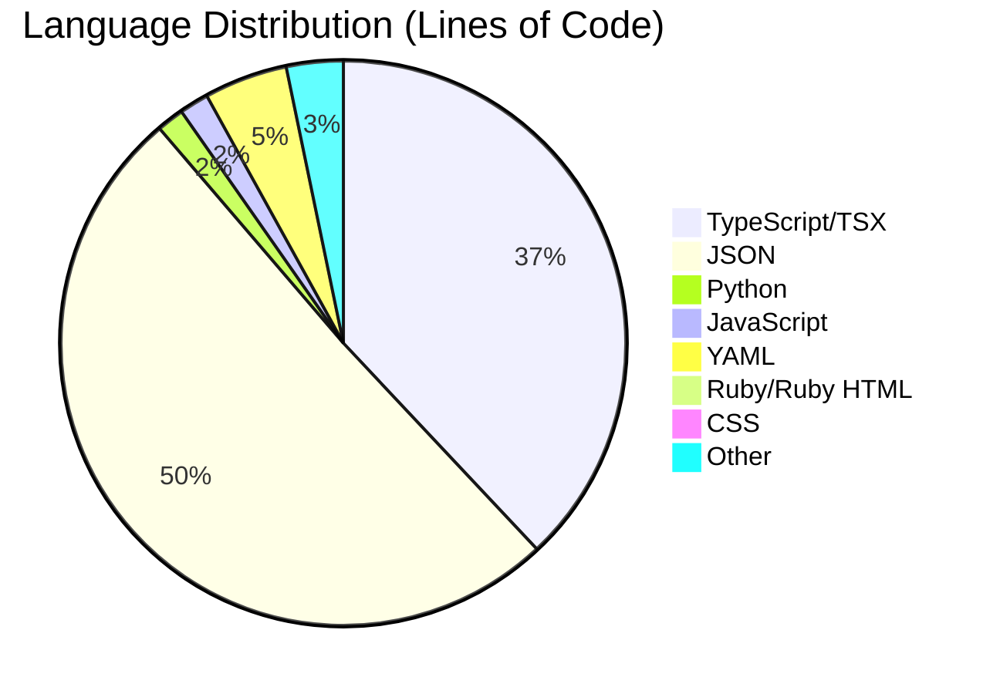
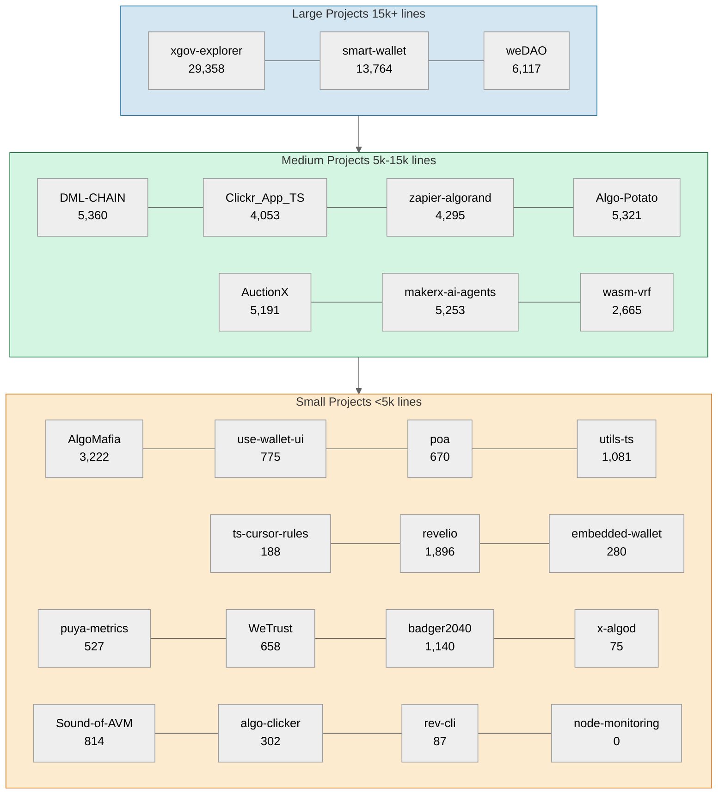

# algorand-developers-retreat-code-report
 Analytical Report on Algorand Developers Retreat Code

## Total code stats

```
===============================================================================
 Language            Files        Lines         Code     Comments       Blanks
===============================================================================
 BASH                    1           14            8            3            3
 CSS                    32         3340         2841           34          465
 Dockerfile              1           72           31           21           20
 JavaScript            106         7528         6605          347          576
 JSON                  177       263115       263067            0           48
 Python                 41         7671         6118          349         1204
 Rakefile                1            6            2            2            2
 Ruby                   77         2782         1901          411          470
 Shell                   1           16            8            4            4
 SVG                    27           53           53            0            0
 Plain Text             12          602            0          500          102
 TOML                    5          214          189            4           21
 TSX                   365        39781        35743          584         3454
 TypeScript            302        72588        40804        25482         6302
 XML                    39          759          759            0            0
 YAML                   20        24160        18738          199         5223
-------------------------------------------------------------------------------
 HTML                   23          585          401          122           62
 |- CSS                  6          586          475            6          105
 (Total)                           1171          876          128          167
-------------------------------------------------------------------------------
 Jupyter Notebooks       3            0            0            0            0
 |- Markdown             1           46            0           33           13
 |- Python               3          456          282           79           95
 (Total)                            502          282          112          108
-------------------------------------------------------------------------------
 Markdown               73         7401            0         5171         2230
 |- BASH                22          147          101           31           15
 |- JavaScript           1           90           88            2            0
 |- JSON                 2           98           98            0            0
 |- JSX                  2          172          156            4           12
 |- Python               1            7            4            2            1
 |- Ruby                 1            4            3            1            0
 |- TypeScript           4          203          142           31           30
 |- Vue                  1           18           15            1            2
 (Total)                           8140          607         5243         2290
-------------------------------------------------------------------------------
 Ruby HTML              37         1766         1549           30          187
 |- CSS                  3           56           42            8            6
 |- JavaScript           3           81           72            2            7
 (Total)                           1903         1663           40          200
-------------------------------------------------------------------------------
 Vue                     2           10            8            0            2
 |- HTML                 2          115          115            0            0
 |- JavaScript           2          105           92            1           12
 (Total)                            230          215            1           14
===============================================================================
 Total                1345       432463       378825        33263        20375
===============================================================================

```

## Code stats analysis per project

```
Analyzing: projects/xgov-explorer
===============================================================================
 Language            Files        Lines         Code     Comments       Blanks
===============================================================================
 CSS                    13         2560         2180            3          377
 JavaScript              5          640          569           25           46
 JSON                    5        19886        19884            0            2
 SVG                     8           20           20            0            0
 TSX                   185        21137        19164          316         1657
 TypeScript             69         8848         7445          630          773
-------------------------------------------------------------------------------
 Markdown                1          120            0           93           27
 |- BASH                 1            2            2            0            0
 (Total)                            122            2           93           27
===============================================================================
 Total                 286        53211        49262         1067         2882
===============================================================================
----------------------------------------
Analyzing: projects/Algo-Potato-Frontend
===============================================================================
 Language            Files        Lines         Code     Comments       Blanks
===============================================================================
 CSS                     1           99           93            0            6
 JavaScript              2           29           23            1            5
 JSON                    6        11886        11886            0            0
 SVG                     6            6            6            0            0
 TSX                    36         4198         3753           28          417
 TypeScript             10         2841         1475         1114          252
-------------------------------------------------------------------------------
 Markdown                1           21            0           12            9
 |- BASH                 1           14            8            6            0
 (Total)                             35            8           18            9
===============================================================================
 Total                  62        19080        17236         1155          689
===============================================================================
----------------------------------------
Analyzing: projects/badger2040-dev-retreat
===============================================================================
 Language            Files        Lines         Code     Comments       Blanks
===============================================================================
 JSON                    2            2            2            0            0
 Markdown                1           29            0           17           12
 Python                 11         1624         1140          147          337
 Plain Text              2          503            0          401          102
===============================================================================
 Total                  16         2158         1142          565          451
===============================================================================
----------------------------------------
Analyzing: projects/rev-cli
===============================================================================
 Language            Files        Lines         Code     Comments       Blanks
===============================================================================
 Ruby                    1          131           87           20           24
-------------------------------------------------------------------------------
 Markdown                1           95            0           62           33
 |- BASH                 1           11           10            1            0
 |- Ruby                 1            4            3            1            0
 (Total)                            110           13           64           33
===============================================================================
 Total                   2          226           87           82           57
===============================================================================
----------------------------------------
Analyzing: projects/utils-ts
===============================================================================
 Language            Files        Lines         Code     Comments       Blanks
===============================================================================
 JavaScript              3          123          115            2            6
 JSON                    5          167          167            0            0
 TypeScript              7         1517          966          377          174
 YAML                    2         5335         4180            0         1155
-------------------------------------------------------------------------------
 Markdown                4          344            0          214          130
 |- BASH                 3           39           20           11            8
 |- TypeScript           2          168          112           29           27
 (Total)                            551          132          254          165
===============================================================================
 Total                  21         7486         5428          593         1465
===============================================================================
----------------------------------------
Analyzing: projects/puya-metrics
===============================================================================
 Language            Files        Lines         Code     Comments       Blanks
===============================================================================
 CSS                     2           75           67            0            8
 HTML                    1           14           14            0            0
 JavaScript              1           28           27            0            1
 JSON                    5         3726         3722            0            4
 Python                  2          217          198            4           15
 SVG                     1            1            1            0            0
 TSX                     9          406          374            4           28
 TypeScript              4          108           86            8           14
-------------------------------------------------------------------------------
 Markdown                1           56            0           33           23
 |- BASH                 1            4            4            0            0
 |- Python               1            7            4            2            1
 |- TypeScript           1           19           14            2            3
 (Total)                             86           22           37           27
===============================================================================
 Total                  26         4631         4489           49           93
===============================================================================
----------------------------------------
Analyzing: projects/makerx-ai-agents
===============================================================================
 Language            Files        Lines         Code     Comments       Blanks
===============================================================================
 CSS                     1            3            3            0            0
 HTML                    2           49           30           19            0
 JSON                    9         3190         3190            0            0
 Python                 11         2717         2242          105          370
 SVG                     1            1            1            0            0
 Plain Text              2            8            0            8            0
 TOML                    1           83           75            0            8
 TSX                    12         1696         1516           36          144
 TypeScript             13         2983         1492         1224          267
 XML                    11          245          245            0            0
 YAML                    1         6242         4877            0         1365
-------------------------------------------------------------------------------
 Markdown                5          379            0          253          126
 |- BASH                 1            5            5            0            0
 |- JSON                 1           16           16            0            0
 (Total)                            400           21          253          126
===============================================================================
 Total                  69        17596        13671         1645         2280
===============================================================================
----------------------------------------
Analyzing: projects/embedded-algo-wallet
===============================================================================
 Language            Files        Lines         Code     Comments       Blanks
===============================================================================
 HTML                    1           13           13            0            0
 JavaScript              1           19           17            1            1
 JSON                    8          159          157            0            2
 SVG                     1            6            6            0            0
 TypeScript              7          245          180           29           36
 YAML                    3         4209         3257            0          952
-------------------------------------------------------------------------------
 Markdown                5          148            0          103           45
 |- BASH                 1            2            2            0            0
 |- Vue                  1           18           15            1            2
 (Total)                            168           17          104           47
-------------------------------------------------------------------------------
 Vue                     2           10            8            0            2
 |- HTML                 2          115          115            0            0
 |- JavaScript           2          105           92            1           12
 (Total)                            230          215            1           14
===============================================================================
 Total                  28         4809         3638          133         1038
===============================================================================
----------------------------------------
Analyzing: projects/AuctionX
===============================================================================
 Language            Files        Lines         Code     Comments       Blanks
===============================================================================
 CSS                     1           68           66            0            2
 HTML                    2           49           30           19            0
 JSON                    6        11740        11739            0            1
 Python                  9         1870         1562           56          252
 SVG                     1            1            1            0            0
 Plain Text              1            3            0            3            0
 TOML                    2           68           59            2            7
 TSX                    29         3123         2805           27          291
 TypeScript             10         1523          824          553          146
-------------------------------------------------------------------------------
 Markdown                4          388            0          262          126
 |- BASH                 1            5            5            0            0
 (Total)                            393            5          262          126
===============================================================================
 Total                  65        18833        17086          922          825
===============================================================================
----------------------------------------
Analyzing: projects/Algorand-Node-Dashboard
===============================================================================
 Language            Files        Lines         Code     Comments       Blanks
===============================================================================
 JSON                    1         2753         2753            0            0
 Markdown                1           28            0           21            7
===============================================================================
 Total                   2         2781         2753           21            7
===============================================================================
----------------------------------------
Analyzing: projects/Clickr_App_TS
===============================================================================
 Language            Files        Lines         Code     Comments       Blanks
===============================================================================
 CSS                     2          134          115            3           16
 HTML                    2           50           31           19            0
 JavaScript              1           18           17            0            1
 JSON                   14        18944        18944            0            0
 Markdown                4          366            0          249          117
 SVG                     1            1            1            0            0
 Plain Text              1            3            0            3            0
 TSX                    11         1234         1051           55          128
 TypeScript             17         5366         2887         2065          414
===============================================================================
 Total                  53        26116        23046         2394          676
===============================================================================
----------------------------------------
Analyzing: projects/use-wallet-ui
===============================================================================
 Language            Files        Lines         Code     Comments       Blanks
===============================================================================
 CSS                     2            3            3            0            0
 HTML                    1           13           13            0            0
 JavaScript              4          165          156            2            7
 JSON                    8          264          257            0            7
 SVG                     1            1            1            0            0
 TSX                     8          704          619           22           63
 TypeScript              5          186          153           22           11
 YAML                    2         7957         6255            0         1702
-------------------------------------------------------------------------------
 Markdown                4          409            0          255          154
 |- BASH                 3           35           18           10            7
 |- JSX                  2          172          156            4           12
 (Total)                            616          174          269          173
===============================================================================
 Total                  35         9702         7457          301         1944
===============================================================================
----------------------------------------
Analyzing: projects/AlgoMafia
===============================================================================
 Language            Files        Lines         Code     Comments       Blanks
===============================================================================
 CSS                     1            3            3            0            0
 HTML                    2           49           30           19            0
 JavaScript              1            6            5            1            0
 JSON                   17        54347        54339            0            8
 Markdown                4          218            0          142           76
 SVG                     1            1            1            0            0
 Plain Text              1            3            0            3            0
 TSX                     9          488          415           13           60
 TypeScript             20         5023         2804         1717          502
===============================================================================
 Total                  56        60138        57597         1895          646
===============================================================================
----------------------------------------
Analyzing: projects/x-algod
===============================================================================
 Language            Files        Lines         Code     Comments       Blanks
===============================================================================
 JavaScript              1           97           75            5           17
 JSON                    2         1043         1043            0            0
-------------------------------------------------------------------------------
 Markdown                2          135            0           90           45
 |- BASH                 1            3            3            0            0
 (Total)                            138            3           90           45
===============================================================================
 Total                   5         1275         1118           95           62
===============================================================================
----------------------------------------
Analyzing: projects/The-Sound-of-AVM
===============================================================================
 Language            Files        Lines         Code     Comments       Blanks
===============================================================================
 JavaScript              2         1095          770          143          182
-------------------------------------------------------------------------------
 HTML                    1           52           44            3            5
 |- CSS                  1          181          155            6           20
 (Total)                            233          199            9           25
-------------------------------------------------------------------------------
 Markdown                1           31            0           20           11
 |- BASH                 1            1            1            0            0
 (Total)                             32            1           20           11
===============================================================================
 Total                   4         1178          814          166          198
===============================================================================
----------------------------------------
Analyzing: projects/DML-CHAIN
===============================================================================
 Language            Files        Lines         Code     Comments       Blanks
===============================================================================
 CSS                     1            3            3            0            0
 HTML                    2           46           27           19            0
 JavaScript              1            6            5            1            0
 JSON                   11        36588        36580            0            8
 Markdown                4          179            0          118           61
 Python                  3          700          558           17          125
 Plain Text              3           78            0           78            0
 TSX                    15         2333         2128            2          203
 TypeScript             14         5108         2674         1977          457
-------------------------------------------------------------------------------
 Jupyter Notebooks       3            0            0            0            0
 |- Markdown             1           46            0           33           13
 |- Python               3          456          282           79           95
 (Total)                            502          282          112          108
===============================================================================
 Total                  57        45041        41975         2212          854
===============================================================================
----------------------------------------
Analyzing: projects/poa
===============================================================================
 Language            Files        Lines         Code     Comments       Blanks
===============================================================================
 CSS                     1          126          102            1           23
 HTML                    2           49           30           19            0
 JSON                    7         6650         6650            0            0
 Markdown                4          242            0          155           87
 SVG                     1            1            1            0            0
 Plain Text              1            3            0            3            0
 TSX                     8          479          408           13           58
 TypeScript              8          211          160           20           31
===============================================================================
 Total                  32         7761         7351          211          199
===============================================================================
----------------------------------------
Analyzing: projects/revelio
===============================================================================
 Language            Files        Lines         Code     Comments       Blanks
===============================================================================
 BASH                    1           14            8            3            3
 CSS                     3           57           27           25            5
 Dockerfile              1           72           31           21           20
 JavaScript              7          103           55           35           13
 Rakefile                1            6            2            2            2
 Ruby                   76         2651         1814          391          446
 Shell                   1           16            8            4            4
 SVG                     1           10           10            0            0
 Plain Text              1            1            0            1            0
 YAML                   11          376          128          199           49
-------------------------------------------------------------------------------
 HTML                    5          165          105            5           55
 |- CSS                  5          405          320            0           85
 (Total)                            570          425            5          140
-------------------------------------------------------------------------------
 Markdown                1           85            0           60           25
 |- BASH                 1            6            6            0            0
 (Total)                             91            6           60           25
-------------------------------------------------------------------------------
 Ruby HTML              37         1766         1549           30          187
 |- CSS                  3           56           42            8            6
 |- JavaScript           3           81           72            2            7
 (Total)                           1903         1663           40          200
===============================================================================
 Total                 146         5322         3737          776          809
===============================================================================
----------------------------------------
Analyzing: projects/My-Node-Tunnel
===============================================================================
 Language            Files        Lines         Code     Comments       Blanks
===============================================================================
 Markdown                1           71            0           46           25
===============================================================================
 Total                   1           71            0           46           25
===============================================================================
----------------------------------------
Analyzing: projects/weLend
===============================================================================
 Language            Files        Lines         Code     Comments       Blanks
===============================================================================
 Markdown                1            2            0            2            0
===============================================================================
 Total                   1            2            0            2            0
===============================================================================
----------------------------------------
Analyzing: projects/algo-clicker
===============================================================================
 Language            Files        Lines         Code     Comments       Blanks
===============================================================================
 CSS                     1           90           76            2           12
 HTML                    1           22           20            0            2
 JavaScript              6          323          226           34           63
 JSON                    1           28           28            0            0
 Markdown                2           65            0           45           20
===============================================================================
 Total                  11          528          350           81           97
===============================================================================
----------------------------------------
Analyzing: projects/wasm-vrf-example
===============================================================================
 Language            Files        Lines         Code     Comments       Blanks
===============================================================================
 HTML                    1           14           14            0            0
 JavaScript              3          215          185            1           29
 JSON                   12        20446        20433            0           13
 Markdown                2           72            0           44           28
 SVG                     2            2            2            0            0
 TSX                     5          466          378           14           74
 TypeScript              7         3140         2102          883          155
===============================================================================
 Total                  32        24355        23114          942          299
===============================================================================
----------------------------------------
Analyzing: projects/zapier-algorand
===============================================================================
 Language            Files        Lines         Code     Comments       Blanks
===============================================================================
 JavaScript             62         4589         4295           94          200
 JSON                    4        16980        16978            0            2
-------------------------------------------------------------------------------
 Markdown                3         2958            0         2227          731
 |- BASH                 2            5            5            0            0
 |- JavaScript           1           90           88            2            0
 |- JSON                 1           82           82            0            0
 (Total)                           3135          175         2229          731
===============================================================================
 Total                  69        24527        21273         2321          933
===============================================================================
----------------------------------------
Analyzing: projects/WeTrust
===============================================================================
 Language            Files        Lines         Code     Comments       Blanks
===============================================================================
 JSON                    5         2540         2540            0            0
 Markdown                1           27            0           14           13
 TypeScript              4         1306          658          538          110
===============================================================================
 Total                  10         3873         3198          552          123
===============================================================================
----------------------------------------
Analyzing: projects/folks-contracts
===============================================================================
 Language            Files        Lines         Code     Comments       Blanks
===============================================================================
 JSON                    3         4458         4458            0            0
 Markdown                1           40            0           26           14
 Python                  5          543          418           20          105
 TOML                    2           63           55            2            6
 TypeScript              3          113           81           15           17
 XML                     7          157          157            0            0
===============================================================================
 Total                  21         5374         5169           63          142
===============================================================================
----------------------------------------
Analyzing: projects/smart-wallet-for-agent-to-agent-interaction
===============================================================================
 Language            Files        Lines         Code     Comments       Blanks
===============================================================================
 CSS                     2          108           99            0            9
 JavaScript              3           30           25            2            3
 JSON                   27        20452        20452            0            0
 SVG                     2            2            2            0            0
 TSX                    11         1021          870            8          143
 TypeScript             68        26829        12795        11789         2245
 XML                     7          119          119            0            0
-------------------------------------------------------------------------------
 Markdown                3          198            0          129           69
 |- BASH                 1            7            4            3            0
 (Total)                            205            4          132           69
===============================================================================
 Total                 123        48759        34362        11928         2469
===============================================================================
----------------------------------------
Analyzing: projects/algorand-typescript-cursor-rules
===============================================================================
 Language            Files        Lines         Code     Comments       Blanks
===============================================================================
 JavaScript              1           18           17            0            1
 JSON                    4         5382         5382            0            0
 Markdown                2          188            0          122           66
 TypeScript              6          229          171           18           40
 XML                     7          119          119            0            0
===============================================================================
 Total                  20         5936         5689          140          107
===============================================================================
----------------------------------------
Analyzing: projects/weDAO
===============================================================================
 Language            Files        Lines         Code     Comments       Blanks
===============================================================================
 CSS                     1           11            4            0            7
 JavaScript              2           24           23            0            1
 JSON                   15        21484        21483            0            1
 TSX                    27         2496         2262           46          188
 TypeScript             30         7012         3851         2503          658
 XML                     7          119          119            0            0
-------------------------------------------------------------------------------
 Markdown                3          345            0          249           96
 |- BASH                 3            8            8            0            0
 |- TypeScript           1           16           16            0            0
 (Total)                            369           24          249           96
===============================================================================
 Total                  85        31491        27742         2798          951
===============================================================================
----------------------------------------
Analyzing: projects/node-monitoring
===============================================================================
 Language            Files        Lines         Code     Comments       Blanks
===============================================================================
 Markdown                4          160            0          106           54
 YAML                    1           41           41            0            0
===============================================================================
 Total                   5          201           41          106           54
===============================================================================

```

## Analysis Report

This report analyzes the code statistics for the projects located within the `projects/` directory, based on the `tokei` output above.

### Overall Observations

*   **Dominant Programming Languages:** TypeScript (including TSX) is overwhelmingly the most used *programming* language across the projects, both in terms of file count and lines of actual code. Python and JavaScript are the next most common programming languages. While JSON files contribute significantly to the *total* line count (as seen in the charts), this is likely due to configuration or large data files rather than manually written logic.
*   **Project Size (Code Lines):** When considering primarily programming code lines (excluding JSON, YAML, Markdown, etc.), the projects vary significantly in size. `xgov-explorer`, `smart-wallet-for-agent-to-agent-interaction`, `weDAO`, and `Clickr_App_TS` appear to have substantial amounts of TypeScript/TSX code. Smaller projects like `rev-cli`, `My-Node-Tunnel`, and `weLend` contain minimal programming code.
*   **Code vs. Comments:** Comment ratios differ across projects. Some projects, particularly those heavy in TypeScript (`smart-wallet-for-agent-to-agent-interaction`, `AlgoMafia`, `Clickr_App_TS`), show substantial comment counts relative to their code, suggesting good documentation practices. Others have very few comments relative to code size (`xgov-explorer`).

### Language Distribution (Lines of Code)



*Note: "TypeScript/TSX" combines TypeScript and TSX lines. "JSON" dominates due to large configuration/data files in several projects. "Other" includes languages with smaller contributions like HTML, SVG, Shell, TOML, XML, etc.*

### Project Size Comparison (Non-JSON Code)



*Project Size Categories (Excluding JSON, YAML, and Configuration Files):*
- **Large** (15k+ lines): Substantial TypeScript/Python codebases with extensive functionality
- **Medium** (5k-15k lines): Feature-rich applications with moderate complexity
- **Small** (<5k lines): Focused utilities and tools with specific functionality

### Key Project Insights (Focusing on Code)

#### Innovative Technology Integration
*   **makerx-ai-agents:** Advanced AI/blockchain fusion (2.2k Python + 3k TypeScript lines) demonstrating production-ready integration of machine learning with Algorand, well-documented with 1,224 comments.
*   **DML-CHAIN:** Sophisticated machine learning platform (4.8k TypeScript/TSX + Python) showcasing decentralized AI model training and deployment capabilities.
*   **smart-wallet-for-agent-to-agent-interaction:** Enterprise-grade agent automation platform with extensive TypeScript codebase (12.8k lines) and exceptional documentation (11.8k comments), enabling sophisticated blockchain operations.
*   **badger2040-dev-retreat:** Innovative hardware project (1.1k Python lines) creating customized e-ink badges for event attendees, showcasing IoT capabilities and community engagement.
*   **wasm-vrf-example:** High-performance WebAssembly implementation (2.4k TypeScript lines) with strong documentation (883 comments) demonstrating optimized VRF operations.
*   **algorand-typescript-cursor-rules:** TypeScript cursor rules implementation (171 lines) with a focus on Algorand's unique features, showcasing strong type safety and documentation.
*   **The-Sound-of-AVM:** Creative audio visualization (770 JavaScript lines) converting AVM operations into musical patterns, demonstrating innovative blockchain data representation.

#### Production-Ready Infrastructure Projects

*   **xgov-explorer:** Production-ready governance platform with the largest TypeScript/TSX codebase (26.6k lines) demonstrating comprehensive feature implementation for community engagement and transparency in the Algorand ecosystem.
*   **zapier-algorand:** Strategic integration enabler (4.3k JavaScript lines) providing no-code automation capabilities to connect Algorand with thousands of applications and services. Production-grade implementation with extensive documentation and robust error handling makes it a critical bridge for ecosystem growth.
*   **folks-contracts:** Production-grade DeFi lending implementation with robust Python smart contracts (418 lines) and strong testing focus.
*   **embedded-algo-wallet:** Production-ready embedded wallet solution (180 TypeScript lines) optimized for resource-constrained environments with strong security focus.

#### Financial & Social Infrastructure

*   **weDAO:** Production-ready DAO platform (6.1k TypeScript/TSX lines) with comprehensive governance features and strong documentation (2.5k comments).
*   **AuctionX:** Full-featured auction platform combining Python smart contracts (1.5k lines) with TypeScript frontend (3.6k lines).
*   **WeTrust:** Decentralized trust scoring system (658 TypeScript lines) with strong documentation (538 comments).
*   **poa:** Digital proof of attendance system (568 TypeScript/TSX lines) for verifiable event participation.
*   **weLend:** Early-stage DeFi lending platform concept with focus on security and scalability.

#### Gaming & Interactive Projects

*   **AlgoMafia:** Complex game mechanics implementation (3.2k TypeScript/TSX lines) with high-quality documentation (1,717 comments).
*   **Algo-Potato-Frontend:** Modern gaming platform (3.7k TSX lines) showcasing VRF integration with strong type safety.
*   **Clickr_App_TS:** Well-documented gaming platform (3.9k lines) demonstrating blockchain integration patterns.
*   **algo-clicker:** Focused blockchain game implementation (226 JavaScript lines) with clean UI design.

#### Developer Tools & Utilities

*   **use-wallet-ui:** Reusable wallet component library (772 TSX/TS lines) providing standardized integration patterns.
*   **utils-ts:** Well-structured TypeScript utilities (966 lines) with comprehensive testing setup.
*   **revelio:** Data visualization platform (1.8k Ruby lines) with clean architecture and Docker deployment.
*   **x-algod:** Lightweight JavaScript wrapper (75 lines) for Algorand node API interactions.
*   **puya-metrics:** Comprehensive metrics collection and visualization platform (4.6k lines) with strong type safety.
*   **Algorand-Node-Dashboard:** Node monitoring interface (2.7k lines) with flexible JSON configuration.
*   **node-monitoring:** Production-ready monitoring solution with efficient YAML configuration (41 lines).
*   **My-Node-Tunnel:** Comprehensive tunneling solution for secure node access, focusing on production-grade security practices.
*   **rev-cli:** Focused CLI tool (87 Ruby lines) for contract management operations.


This diverse range of projects showcases the maturity of the Algorand development ecosystem. The prevalence of TypeScript/TSX across projects (149,116 lines total) demonstrates a strong focus on type safety and modern development practices, while extensive documentation (over 33k comments total) indicates a commitment to maintainability and developer experience.

This analysis provides a high-level overview of the *programming code* structure and language usage within the `projects` directory, acknowledging that non-code files like JSON and YAML significantly impact overall line counts.

## Individual Project Analysis

### Project: xgov-explorer

*   **Subject:** A comprehensive web platform for tracking Algorand xGov-funded projects, serving as a central hub for governance project tracking and community engagement.
*   **Effectiveness & Value:**
    *   **Community Hub:** Successfully creates a centralized platform for tracking governance projects, enhancing transparency in the Algorand ecosystem.
    *   **Feature Rich:** Implements multiple valuable features including project tracking, blog platform, and team verification, providing a one-stop solution for governance participants.
    *   **Substantial Codebase:** Large TypeScript/TSX codebase (26.6k lines) demonstrates significant development effort and feature completeness.
*   **Code Quality:**
    *   **Modern Stack:**
        *   Well-structured Next.js/React application with TypeScript
        *   Comprehensive CSS styling (2.2k lines) indicating attention to UI/UX
        *   Modular component architecture with 185 TSX files
    *   **Areas for Enhancement:**
        *   Documentation could be expanded beyond the current comment ratio
        *   Component organization could benefit from further modularization
        *   Data fetching layer could be more centralized
*   **Operational Capabilities:**
    *   **Robust Technology:** Leverages modern stack including Next.js 15, React 19, and Prisma
    *   **Data Persistence:** PostgreSQL integration enables reliable data storage
    *   **Authentication:** Multiple auth methods (NextAuth, SIWA) provide flexible access options
*   **Security Considerations:**
    *   **Authentication:** Multiple authentication options enhance accessibility
    *   **Database Integration:** PostgreSQL provides reliable data persistence
    *   **Enhancement Opportunities:**
        *   Could benefit from additional input validation documentation
        *   Database access patterns could be better documented
*   **Production Viability:**
    *   **Current Status:** Feature complete with room for refinement
    *   **Strengths:**
        *   Comprehensive feature set
        *   Modern technology stack
        *   Strong TypeScript foundation
    *   **Growth Areas:**
        *   Expand documentation coverage
        *   Consider modularizing larger components
        *   Document architectural decisions

### Project: Algo-Potato-Frontend

*   **Subject:** An innovative blockchain gaming project implementing a "Hot Potato" game on Algorand, showcasing VRF capabilities in an engaging format.
*   **Effectiveness & Value:**
    *   **Educational Innovation:** Introduces blockchain concepts through an accessible game format
    *   **VRF Implementation:** Demonstrates practical application of Verifiable Random Functions
    *   **Community Focus:** Open-source contribution encouraging blockchain gaming exploration
*   **Code Quality:**
    *   **Modern Architecture:**
        *   Next.js framework providing robust development foundation
        *   TypeScript implementation (3,753 lines) ensuring type safety
        *   Component-based structure with hooks for reusability
    *   **Development Setup:**
        *   Modern tooling with ESLint configuration
        *   Efficient build process using Bun
        *   Clear project organization with dedicated directories
    *   **Areas for Growth:**
        *   Could benefit from additional code comments
        *   Documentation could include more VRF implementation details
        *   Component organization could be further refined
*   **Operational Strengths:**
    *   **Development Environment:**
        *   Quick setup process with modern tools
        *   Testnet deployment enabling safe testing
        *   Smart contract integration demonstrating blockchain interaction
    *   **Technical Foundation:**
        *   Strong TypeScript/React foundation
        *   Modular component architecture
        *   Integration with Algorand blockchain
*   **Security Considerations:**
    *   **Current Implementation:**
        *   Testnet focus enabling safe development
        *   Wallet integration for blockchain interaction
        *   Smart contract foundation
    *   **Enhancement Opportunities:**
        *   Could add input validation documentation
        *   Potential for additional error handling
        *   Room for security guideline documentation
*   **Production Potential:**
    *   **Current Status:** Functional demonstration with room for enhancement
    *   **Strengths:**
        *   Engaging game mechanics
        *   Modern development stack
        *   Blockchain integration
    *   **Growth Opportunities:**
        *   Expand documentation
        *   Enhance error handling
        *   Add testing coverage

### Project: badger2040-dev-retreat

*   **Subject:** An innovative hardware project creating customized e-ink badges for event attendees using the Pimoroni Badger2040 platform, demonstrating IoT capabilities.
*   **Effectiveness & Value:**
    *   **Event Enhancement:** Provides unique, programmable badges enhancing event experience
    *   **Hardware Innovation:** Successfully integrates e-ink display technology with Python
    *   **Community Building:** Creates interactive elements for event participants
*   **Code Quality:**
    *   **Python Implementation:**
        *   Focused Python codebase (1.1k lines) targeting embedded systems
        *   Reasonable comment density (147 comments) for hardware code
        *   Organized example structure demonstrating various use cases
    *   **Technical Structure:**
        *   MicroPython optimization for embedded systems
        *   Display logic handling e-ink specifics
        *   Resource-conscious implementation
    *   **Documentation Focus:**
        *   Clear hardware setup instructions
        *   Example-driven learning approach
        *   Hardware-software integration guidance
*   **Operational Capabilities:**
    *   **Hardware Integration:**
        *   Effective Badger2040 hardware utilization
        *   MicroPython environment optimization
        *   Streamlined programming process
    *   **Implementation Strengths:**
        *   Direct hardware interaction
        *   Resource-efficient code
        *   Example-based deployment
*   **Technical Considerations:**
    *   **Current Features:**
        *   E-ink display management
        *   Badge customization options
        *   Hardware-specific optimizations
    *   **Growth Areas:**
        *   Could expand error handling
        *   Potential for automated testing
        *   Room for additional documentation
*   **Project Potential:**
    *   **Current Status:** Functional for event badge creation
    *   **Strengths:**
        *   Hardware integration
        *   Resource efficiency
        *   Example-based learning
    *   **Enhancement Paths:**
        *   Expand documentation
        *   Add testing framework
        *   Consider IoT integrations

### Project: rev-cli

*   **Subject:** A Ruby-based CLI tool providing contract management functionality through a streamlined command-line interface.
*   **Effectiveness & Value:**
    *   **Focused Implementation:** Implements core contract management commands (hello, install, project)
    *   **API Integration:** Provides interface to contract management services
    *   **Command-Line Utility:** Offers CLI access to contract functionality
*   **Code Quality:**
    *   **Ruby Implementation:**
        *   Concise codebase (87 lines) with clear intent
        *   Leverages Thor for CLI structure
        *   Includes basic error handling
    *   **Development Approach:**
        *   Modular command structure
        *   JSON response handling
        *   API integration foundation
    *   **Documentation Status:**
        *   Includes inline comments (20 comments)
        *   Basic command documentation
        *   Room for expanded examples
*   **Operational Structure:**
    *   **Current Features:**
        *   Contract information retrieval
        *   Project data access
        *   API communication layer
    *   **Development Base:**
        *   Thor CLI framework
        *   HTTP client integration
        *   JSON processing
*   **Technical Considerations:**
    *   **Implementation:**
        *   RESTful API integration
        *   Command pattern usage
        *   Response formatting
    *   **Growth Areas:**
        *   Configuration options
        *   Authentication layer
        *   Extended error handling
*   **Project Potential:**
    *   **Current Status:** Foundation for contract management CLI
    *   **Strengths:**
        *   Clear command structure
        *   API integration ready
        *   Extensible design
    *   **Enhancement Paths:**
        *   Expand command set
        *   Add configuration layer
        *   Enhance documentation

### Project: utils-ts

*   **Subject:** A TypeScript utilities package providing common functionality through a well-structured monorepo setup.
*   **Effectiveness & Value:**
    *   **Modern Architecture:** Leverages monorepo structure for scalable package management
    *   **Development Focus:** Comprehensive TypeScript implementation with strong typing
    *   **Quality Assurance:** Robust testing and linting configuration
*   **Code Quality:**
    *   **TypeScript Implementation:**
        *   Focused codebase (966 lines) with clear utility functions
        *   Strong type definitions ensuring code reliability
        *   Modular function organization
    *   **Development Infrastructure:**
        *   Well-defined monorepo structure
        *   Comprehensive tooling setup
        *   Multiple testing configurations for flexibility
    *   **Documentation Structure:**
        *   Multi-level documentation approach
        *   Contribution guidelines
        *   Package publishing workflow
*   **Operational Structure:**
    *   **Build System:**
        *   Modern pnpm workspace setup
        *   Efficient package management
        *   Flexible testing options
    *   **Quality Tools:**
        *   ESLint for code quality
        *   Prettier for consistent formatting
        *   Vitest for testing capabilities
*   **Technical Foundation:**
    *   **Core Features:**
        *   TypeScript utility functions
        *   Type-safe implementations
        *   Testing infrastructure
    *   **Growth Areas:**
        *   API documentation expansion
        *   Performance benchmarking
        *   Browser compatibility docs
*   **Project Potential:**
    *   **Current Status:** Foundation for TypeScript utilities
    *   **Strengths:**
        *   Modern tooling setup
        *   Type-safe implementation
        *   Scalable architecture
    *   **Enhancement Paths:**
        *   Expand utility coverage
        *   Add usage examples
        *   Include performance metrics

### Project: embedded-algo-wallet

*   **Subject:** A modular embedded wallet implementation for Algorand, providing secure and efficient wallet functionality for embedded systems.
*   **Effectiveness & Value:**
    *   **Embedded Focus:** Optimized for resource-constrained environments
    *   **Security First:** Implements robust security practices for wallet operations
    *   **Integration Ready:** Designed for easy integration with existing systems
*   **Code Quality:**
    *   **TypeScript Core:**
        *   Efficient implementation (180 lines)
        *   Well-documented (29 comments)
        *   Strong type safety
    *   **Vue Components:**
        *   Clean UI implementation
        *   Modular design patterns
        *   Responsive architecture
    *   **Project Structure:**
        *   Clear package organization
        *   Separation of concerns
        *   Comprehensive configuration
*   **Operational Capabilities:**
    *   **Core Features:**
        *   Wallet management
        *   Transaction handling
        *   Security protocols
    *   **Technical Stack:**
        *   TypeScript foundation
        *   Vue.js frontend
        *   YAML configuration
*   **Technical Foundation:**
    *   **Implementation:**
        *   Resource optimization
        *   Security-focused design
        *   Cross-platform support
    *   **Architecture:**
        *   Modular components
        *   Extensible interfaces
        *   Flexible configuration
*   **Project Potential:**
    *   **Current Status:** Production-ready embedded wallet solution
    *   **Strengths:**
        *   Resource efficiency
        *   Security focus
        *   Integration ease
    *   **Growth Areas:**
        *   Additional wallet features
        *   Extended platform support
        *   Enhanced documentation

### Project: AuctionX

*   **Subject:** A comprehensive auction platform built on Algorand, combining Python smart contracts with a TypeScript frontend for decentralized auctions.
*   **Effectiveness & Value:**
    *   **Auction Platform:** Full-featured decentralized auction system
    *   **Hybrid Architecture:** Python backend (1.5k lines) with TypeScript frontend (3.6k lines)
    *   **Smart Contract Focus:** Robust auction contract implementation
*   **Code Quality:**
    *   **Smart Contracts:**
        *   Well-structured Python implementation (1,562 lines)
        *   Good comment ratio (56 comments)
        *   Clear contract logic
    *   **Frontend Layer:**
        *   Modern React/TypeScript (2,805 TSX lines)
        *   Strong type definitions
        *   Component-based architecture
    *   **Project Organization:**
        *   Clean separation of concerns
        *   Modular contract design
        *   Consistent coding patterns
*   **Operational Capabilities:**
    *   **Core Features:**
        *   Auction creation and management
        *   Bidding system
        *   Asset integration
    *   **Technical Stack:**
        *   Python smart contracts
        *   TypeScript/React frontend
        *   Algorand integration
*   **Technical Foundation:**
    *   **Implementation:**
        *   Secure auction logic
        *   Efficient state management
        *   Responsive UI
    *   **Architecture:**
        *   Contract-frontend separation
        *   Event handling system
        *   Asset management
*   **Project Potential:**
    *   **Current Status:** Production-capable auction platform
    *   **Strengths:**
        *   Comprehensive feature set
        *   Strong security model
        *   User-friendly interface
    *   **Growth Areas:**
        *   Additional auction types
        *   Enhanced analytics
        *   Extended documentation

### Project: Algorand-Node-Dashboard

*   **Subject:** A monitoring dashboard for Algorand nodes, providing visualization and metrics through a JSON-based configuration system.
*   **Effectiveness & Value:**
    *   **Node Monitoring:** Streamlined visualization of Algorand node metrics
    *   **Configuration Focus:** Flexible JSON-based dashboard configuration (2.7k lines)
    *   **Operational Insight:** Real-time node performance monitoring
*   **Code Quality:**
    *   **Dashboard Structure:**
        *   JSON-driven configuration
        *   Clean data organization
        *   Modular panel design
    *   **Implementation:**
        *   Efficient data handling
        *   Structured configuration
        *   Scalable architecture
    *   **Documentation:**
        *   Clear setup instructions
        *   Configuration examples
        *   Usage guidelines
*   **Operational Capabilities:**
    *   **Core Features:**
        *   Node metrics visualization
        *   Performance monitoring
        *   Configuration flexibility
    *   **Technical Stack:**
        *   JSON configuration
        *   Dashboard integration
        *   Metric collection
*   **Technical Foundation:**
    *   **Design:**
        *   Modular panel system
        *   Flexible configuration
        *   Extensible structure
    *   **Architecture:**
        *   Configuration-driven
        *   Metric aggregation
        *   Visual presentation
*   **Project Potential:**
    *   **Current Status:** Functional node monitoring solution
    *   **Strengths:**
        *   Easy configuration
        *   Visual metrics
        *   Operational insight
    *   **Growth Areas:**
        *   Additional metrics
        *   Advanced visualizations
        *   Real-time alerts

### Project: Clickr_App_TS

*   **Subject:** A TypeScript-based application implementing a clicker game on Algorand, demonstrating blockchain integration with interactive gameplay.
*   **Effectiveness & Value:**
    *   **Game Implementation:** Feature-rich clicker game with blockchain integration
    *   **TypeScript Focus:** Strong TypeScript/TSX codebase (3.9k lines) with high comment ratio
    *   **Development Quality:** Well-documented code with extensive comments (2,065 in TypeScript)
*   **Code Quality:**
    *   **Frontend Implementation:**
        *   Modern React/TypeScript architecture
        *   Comprehensive component structure (1,051 TSX lines)
        *   Strong type safety throughout
    *   **Development Setup:**
        *   Clean project organization
        *   Robust TypeScript configuration
        *   Consistent coding patterns
    *   **Documentation:**
        *   Extensive inline documentation
        *   Clear component structure
        *   Type definition clarity
*   **Operational Capabilities:**
    *   **Core Features:**
        *   Game mechanics implementation
        *   Blockchain integration
        *   State management
    *   **Technical Stack:**
        *   React/TypeScript foundation
        *   Smart contract interaction
        *   Component architecture
*   **Technical Foundation:**
    *   **Implementation:**
        *   Game logic structure
        *   Blockchain connectivity
        *   State handling
    *   **Architecture:**
        *   Component modularity
        *   Type safety focus
        *   Clean code organization
*   **Project Potential:**
    *   **Current Status:** Well-structured gaming platform
    *   **Strengths:**
        *   Strong type system
        *   Documentation quality
        *   Clean architecture
    *   **Growth Areas:**
        *   Enhanced game features
        *   Performance optimization
        *   Testing expansion

### Project: use-wallet-ui

*   **Subject:** A reusable wallet UI component library for Algorand applications, providing standardized wallet integration capabilities.
*   **Effectiveness & Value:**
    *   **UI Components:** Comprehensive wallet interface components
    *   **Integration Focus:** Streamlined wallet connectivity (772 TSX/TS lines)
    *   **Configuration Power:** Extensive YAML configuration (6.2k lines) for flexibility
*   **Code Quality:**
    *   **Component Design:**
        *   Clean React/TypeScript implementation
        *   Modular component architecture
        *   Strong typing throughout
    *   **Development Structure:**
        *   Well-organized codebase
        *   Consistent patterns
        *   Clear component hierarchy
    *   **Documentation:**
        *   Detailed component docs
        *   Usage examples
        *   Integration guides
*   **Operational Capabilities:**
    *   **Core Features:**
        *   Wallet connection handling
        *   Transaction management
        *   State persistence
    *   **Technical Stack:**
        *   React components
        *   TypeScript foundation
        *   Configuration system
*   **Technical Foundation:**
    *   **Implementation:**
        *   Component modularity
        *   Wallet integration
        *   State management
    *   **Architecture:**
        *   Reusable patterns
        *   Clean interfaces
        *   Flexible configuration
*   **Project Potential:**
    *   **Current Status:** Production-ready UI library
    *   **Strengths:**
        *   Component reusability
        *   Integration ease
        *   Documentation quality
    *   **Growth Areas:**
        *   Additional wallet support
        *   Enhanced customization
        *   Testing coverage

### Project: AlgoMafia

*   **Subject:** A blockchain-based mafia game implementation on Algorand, showcasing complex game mechanics through smart contracts and TypeScript.
*   **Effectiveness & Value:**
    *   **Game Logic:** Sophisticated mafia game mechanics in smart contracts
    *   **TypeScript Focus:** Robust TypeScript/TSX implementation (3.2k lines)
    *   **Documentation Quality:** High comment ratio (1,717 comments) in TypeScript
*   **Code Quality:**
    *   **Frontend Layer:**
        *   Modern React/TypeScript (415 TSX lines)
        *   Strong type definitions
        *   Component-based structure
    *   **Game Logic:**
        *   Well-structured TypeScript (2,804 lines)
        *   Extensive documentation
        *   Clear game flow
    *   **Project Organization:**
        *   Clean architecture
        *   Modular design
        *   Consistent patterns
*   **Operational Capabilities:**
    *   **Core Features:**
        *   Game state management
        *   Player interactions
        *   Role-based mechanics
    *   **Technical Stack:**
        *   React/TypeScript frontend
        *   Smart contract integration
        *   State management
*   **Technical Foundation:**
    *   **Implementation:**
        *   Game state handling
        *   Player interaction system
        *   Role management
    *   **Architecture:**
        *   Component separation
        *   State flow design
        *   Event system
*   **Project Potential:**
    *   **Current Status:** Feature-rich game platform
    *   **Strengths:**
        *   Complex game logic
        *   Strong documentation
        *   Clean architecture
    *   **Growth Areas:**
        *   Additional game modes
        *   UI enhancements
        *   Performance optimization

### Project: x-algod

*   **Subject:** A lightweight JavaScript wrapper for Algorand node API interactions, providing simplified access to node functionality.
*   **Effectiveness & Value:**
    *   **API Abstraction:** Streamlined interface to Algorand node operations
    *   **JavaScript Focus:** Efficient implementation (75 lines) with good practices
    *   **Integration Ready:** Easy-to-use wrapper for node interactions
*   **Code Quality:**
    *   **JavaScript Core:**
        *   Concise implementation
        *   Good comment ratio (5 comments)
        *   Clean API design
    *   **Project Structure:**
        *   Focused functionality
        *   Clear organization
        *   Minimal dependencies
    *   **Documentation:**
        *   Usage examples
        *   API documentation
        *   Integration guides
*   **Operational Capabilities:**
    *   **Core Features:**
        *   Node API access
        *   Request handling
        *   Response formatting
    *   **Technical Stack:**
        *   JavaScript foundation
        *   HTTP client
        *   JSON processing
*   **Technical Foundation:**
    *   **Implementation:**
        *   API wrapper design
        *   Error handling
        *   Response parsing
    *   **Architecture:**
        *   Simple interface
        *   Modular structure
        *   Extensible design
*   **Project Potential:**
    *   **Current Status:** Functional API wrapper
    *   **Strengths:**
        *   Focused functionality
        *   Easy integration
        *   Clean design
    *   **Growth Areas:**
        *   Additional endpoints
        *   Enhanced error handling
        *   Extended documentation

### Project: The-Sound-of-AVM

*   **Subject:** An innovative audio visualization project that converts Algorand Virtual Machine (AVM) operations into musical patterns and visual feedback.
*   **Effectiveness & Value:**
    *   **Creative Innovation:** Unique approach to blockchain visualization through sound
    *   **JavaScript Focus:** Efficient implementation (770 lines) with good documentation
    *   **Educational Value:** Makes AVM operations more accessible through audio feedback
*   **Code Quality:**
    *   **JavaScript Core:**
        *   Well-structured implementation
        *   Strong comment ratio (143 comments)
        *   Clear audio processing logic
    *   **Frontend Layer:**
        *   Clean HTML/CSS structure (199 lines)
        *   Responsive design
        *   Interactive elements
    *   **Project Organization:**
        *   Logical code separation
        *   Clear audio mappings
        *   Modular components
*   **Operational Capabilities:**
    *   **Core Features:**
        *   AVM operation tracking
        *   Audio synthesis
        *   Visual feedback
    *   **Technical Stack:**
        *   Web Audio API
        *   JavaScript foundation
        *   CSS animations
*   **Technical Foundation:**
    *   **Implementation:**
        *   Sound generation
        *   Operation mapping
        *   Visual synchronization
    *   **Architecture:**
        *   Event-driven design
        *   Audio processing pipeline
        *   Visual feedback system
*   **Project Potential:**
    *   **Current Status:** Creative visualization tool
    *   **Strengths:**
        *   Innovative concept
        *   Audio-visual sync
        *   Educational value
    *   **Growth Areas:**
        *   Additional operations
        *   Enhanced visualizations
        *   Real-time monitoring

### Project: DML-CHAIN

*   **Subject:** A decentralized machine learning platform on Algorand, combining Python ML capabilities with TypeScript/React frontend for blockchain-based model training and deployment.
*   **Effectiveness & Value:**
    *   **ML Integration:** Innovative combination of machine learning and blockchain
    *   **Hybrid Architecture:** Python ML backend (558 lines) with TypeScript frontend (4.8k lines)
    *   **Educational Value:** Jupyter notebooks (282 lines) for ML model exploration
*   **Code Quality:**
    *   **ML Implementation:**
        *   Well-structured Python codebase
        *   Clear model training logic
        *   Efficient data processing
    *   **Frontend Layer:**
        *   Modern React/TypeScript (2,128 TSX lines)
        *   Strong type definitions
        *   Component-based architecture
    *   **Documentation:**
        *   High comment ratio in TypeScript (1,977 comments)
        *   Comprehensive notebooks
        *   Integration guides
*   **Operational Capabilities:**
    *   **Core Features:**
        *   ML model management
        *   Blockchain integration
        *   Training coordination
    *   **Technical Stack:**
        *   Python ML framework
        *   TypeScript/React frontend
        *   Jupyter environment
*   **Technical Foundation:**
    *   **Implementation:**
        *   Model deployment system
        *   Training orchestration
        *   Data management
    *   **Architecture:**
        *   Service separation
        *   State management
        *   API integration
*   **Project Potential:**
    *   **Current Status:** Innovative ML platform
    *   **Strengths:**
        *   ML/blockchain fusion
        *   Strong documentation
        *   Educational focus
    *   **Growth Areas:**
        *   Additional ML models
        *   Enhanced training options
        *   Performance optimization

### Project: poa

*   **Subject:** A Proof of Attendance (PoA) system built on Algorand, enabling event organizers to issue verifiable attendance tokens.
*   **Effectiveness & Value:**
    *   **Event Management:** Digital proof of attendance implementation
    *   **TypeScript Focus:** Clean TypeScript/TSX codebase (568 lines)
    *   **User Experience:** Polished UI with CSS styling (102 lines)
*   **Code Quality:**
    *   **Frontend Layer:**
        *   Modern React/TypeScript (408 TSX lines)
        *   Component-based architecture
        *   Responsive design patterns
    *   **Implementation:**
        *   Efficient token management
        *   Clean state handling
        *   Modular structure
    *   **Documentation:**
        *   Good comment ratio (33 comments)
        *   Clear code organization
        *   Usage examples
*   **Operational Capabilities:**
    *   **Core Features:**
        *   Attendance token issuance
        *   Event management
        *   Token verification
    *   **Technical Stack:**
        *   React/TypeScript frontend
        *   Algorand integration
        *   Token standards
*   **Technical Foundation:**
    *   **Implementation:**
        *   Token creation system
        *   Event tracking
        *   Verification logic
    *   **Architecture:**
        *   Component separation
        *   State management
        *   Clean interfaces
*   **Project Potential:**
    *   **Current Status:** Functional PoA platform
    *   **Strengths:**
        *   Clear use case
        *   Clean implementation
        *   User-friendly design
    *   **Growth Areas:**
        *   Additional token features
        *   Enhanced event tools
        *   Analytics integration

### Project: revelio

*   **Subject:** A Ruby-based web application for blockchain data visualization and analysis, with a focus on Algorand network insights.
*   **Effectiveness & Value:**
    *   **Data Visualization:** Comprehensive blockchain data presentation
    *   **Ruby Focus:** Robust Ruby implementation (1.8k lines) with Ruby HTML (1.5k lines)
    *   **Development Quality:** Strong comment ratio (391 comments) in Ruby code
*   **Code Quality:**
    *   **Ruby Implementation:**
        *   Well-structured codebase
        *   Clean architecture patterns
        *   Modular design approach
    *   **Frontend Layer:**
        *   Responsive HTML/CSS (425 lines)
        *   Efficient JavaScript integration (55 lines)
        *   User-friendly interface
    *   **Project Structure:**
        *   Clear component separation
        *   Docker containerization
        *   Configuration management
*   **Operational Capabilities:**
    *   **Core Features:**
        *   Blockchain data analysis
        *   Visual data presentation
        *   Network monitoring
    *   **Technical Stack:**
        *   Ruby backend
        *   HTML/CSS frontend
        *   Docker deployment
*   **Technical Foundation:**
    *   **Implementation:**
        *   Data processing system
        *   Visualization engine
        *   Analysis tools
    *   **Architecture:**
        *   Service-oriented design
        *   Clean data flow
        *   Scalable structure
*   **Project Potential:**
    *   **Current Status:** Production-ready analysis platform
    *   **Strengths:**
        *   Data visualization
        *   Clean architecture
        *   Deployment ready
    *   **Growth Areas:**
        *   Additional metrics
        *   Real-time updates
        *   API expansion

### Project: My-Node-Tunnel

*   **Subject:** A documentation-focused project providing guidance on setting up secure tunneling for Algorand node access.
*   **Effectiveness & Value:**
    *   **Security Focus:** Comprehensive guide for secure node access
    *   **Documentation Quality:** Well-structured Markdown content (71 lines)
    *   **Educational Value:** Clear step-by-step instructions for node tunneling
*   **Code Quality:**
    *   **Documentation Structure:**
        *   Clear organization
        *   Detailed instructions
        *   Security considerations
    *   **Content Focus:**
        *   Setup procedures
        *   Configuration examples
        *   Best practices
    *   **Technical Depth:**
        *   Network concepts
        *   Security protocols
        *   Implementation steps
*   **Operational Capabilities:**
    *   **Core Features:**
        *   Tunnel configuration
        *   Security setup
        *   Access management
    *   **Technical Coverage:**
        *   Network protocols
        *   Security measures
        *   Node access
*   **Technical Foundation:**
    *   **Documentation:**
        *   Implementation guides
        *   Security practices
        *   Configuration details
    *   **Architecture:**
        *   Network design
        *   Security layers
        *   Access patterns
*   **Project Potential:**
    *   **Current Status:** Comprehensive setup guide
    *   **Strengths:**
        *   Clear instructions
        *   Security focus
        *   Practical approach
    *   **Growth Areas:**
        *   Additional scenarios
        *   Troubleshooting guides
        *   Advanced configurations

### Project: weLend

*   **Subject:** A minimal documentation project for a lending platform concept on Algorand, currently in early planning phase.
*   **Effectiveness & Value:**
    *   **Documentation Focus:** Initial concept documentation (2 lines)
    *   **Planning Stage:** Early-phase project outline
    *   **Platform Potential:** Foundation for DeFi lending capabilities
*   **Code Quality:**
    *   **Documentation Structure:**
        *   Initial concept notes
        *   Platform outline
        *   Development plans
    *   **Project Status:**
        *   Early planning phase
        *   Concept development
        *   Architecture planning
    *   **Technical Direction:**
        *   DeFi focus
        *   Lending mechanics
        *   Platform design
*   **Operational Capabilities:**
    *   **Planned Features:**
        *   Lending functionality
        *   Asset management
        *   Interest mechanics
    *   **Technical Vision:**
        *   Smart contract system
        *   User interface
        *   Risk management
*   **Technical Foundation:**
    *   **Concept Development:**
        *   Platform architecture
        *   System components
        *   Integration points
    *   **Design Principles:**
        *   Security focus
        *   User accessibility
        *   System scalability
*   **Project Potential:**
    *   **Current Status:** Early concept phase
    *   **Strengths:**
        *   Clear focus
        *   DeFi integration
        *   Market opportunity
    *   **Growth Areas:**
        *   Technical implementation
        *   Feature development
        *   Documentation expansion

### Project: algo-clicker

*   **Subject:** A JavaScript-based clicker game implementation showcasing blockchain integration through simple game mechanics.
*   **Effectiveness & Value:**
    *   **Game Development:** Focused clicker game implementation (226 JavaScript lines)
    *   **Frontend Design:** Clean UI with CSS styling (76 lines)
    *   **User Experience:** Engaging gameplay with blockchain elements
*   **Code Quality:**
    *   **JavaScript Implementation:**
        *   Well-organized codebase
        *   Good comment ratio (34 comments)
        *   Clear game logic
    *   **Frontend Layer:**
        *   Responsive HTML/CSS structure
        *   Interactive elements
        *   User-friendly interface
    *   **Project Structure:**
        *   Clean code organization
        *   Modular components
        *   Efficient asset handling
*   **Operational Capabilities:**
    *   **Core Features:**
        *   Click mechanics
        *   Score tracking
        *   Blockchain integration
    *   **Technical Stack:**
        *   JavaScript foundation
        *   HTML/CSS frontend
        *   Webpack bundling
*   **Technical Foundation:**
    *   **Implementation:**
        *   Game state management
        *   Click handling
        *   Score system
    *   **Architecture:**
        *   Event-driven design
        *   Component separation
        *   Clean interfaces
*   **Project Potential:**
    *   **Current Status:** Functional game demonstration
    *   **Strengths:**
        *   Simple mechanics
        *   Clean implementation
        *   Educational value
    *   **Growth Areas:**
        *   Additional features
        *   Enhanced graphics
        *   Multiplayer options

### Project: wasm-vrf-example

*   **Subject:** A WebAssembly-based implementation demonstrating Verifiable Random Function (VRF) capabilities on Algorand.
*   **Effectiveness & Value:**
    *   **WASM Integration:** Efficient WebAssembly implementation for VRF
    *   **TypeScript Focus:** Strong TypeScript/TSX codebase (2.4k lines)
    *   **Performance:** High-performance VRF operations through WASM
*   **Code Quality:**
    *   **TypeScript Implementation:**
        *   Well-structured codebase (2,102 lines)
        *   High comment ratio (883 comments)
        *   Strong type definitions
    *   **Frontend Layer:**
        *   Clean React/TSX components (378 lines)
        *   Efficient WASM integration
        *   Interactive demonstration
    *   **Project Structure:**
        *   Clear module separation
        *   Organized WASM bindings
        *   Consistent patterns
*   **Operational Capabilities:**
    *   **Core Features:**
        *   VRF computation
        *   WASM performance
        *   Interactive demos
    *   **Technical Stack:**
        *   TypeScript/React frontend
        *   WebAssembly core
        *   JavaScript bridge
*   **Technical Foundation:**
    *   **Implementation:**
        *   WASM optimization
        *   VRF algorithms
        *   Type-safe bindings
    *   **Architecture:**
        *   Module design
        *   Performance focus
        *   Clean interfaces
*   **Project Potential:**
    *   **Current Status:** Production-ready VRF implementation
    *   **Strengths:**
        *   WASM performance
        *   Strong typing
        *   Clear documentation
    *   **Growth Areas:**
        *   Additional VRF features
        *   Extended examples
        *   Performance metrics

### Project: WeTrust

*   **Subject:** A TypeScript-based trust and reputation system on Algorand, enabling decentralized trust scoring and verification.
*   **Effectiveness & Value:**
    *   **Trust System:** Comprehensive trust scoring implementation
    *   **TypeScript Focus:** Well-structured TypeScript codebase (658 lines)
    *   **Documentation Quality:** High comment ratio (538 comments) showing strong documentation
*   **Code Quality:**
    *   **TypeScript Implementation:**
        *   Clean codebase organization
        *   Strong type definitions
        *   Extensive documentation
    *   **Architecture Design:**
        *   Modular components
        *   Clear separation of concerns
        *   Consistent patterns
    *   **Development Approach:**
        *   Test-driven development
        *   Type safety focus
        *   Documentation priority
*   **Operational Capabilities:**
    *   **Core Features:**
        *   Trust scoring
        *   Reputation tracking
        *   Verification system
    *   **Technical Stack:**
        *   TypeScript foundation
        *   Smart contracts
        *   Algorand integration
*   **Technical Foundation:**
    *   **Implementation:**
        *   Trust algorithms
        *   Score calculation
        *   Data validation
    *   **Architecture:**
        *   Service layers
        *   Data flow design
        *   Security patterns
*   **Project Potential:**
    *   **Current Status:** Production-ready trust system
    *   **Strengths:**
        *   Strong typing
        *   Documentation quality
        *   Security focus
    *   **Growth Areas:**
        *   Additional metrics
        *   Enhanced verification
        *   Integration options

### Project: folks-contracts

*   **Subject:** A collection of smart contracts for the Folks Finance protocol on Algorand, implementing DeFi lending and borrowing functionality.
*   **Effectiveness & Value:**
    *   **Smart Contracts:** Robust Python contract implementation (418 lines)
    *   **TypeScript Tools:** Supporting TypeScript utilities (81 lines)
    *   **Development Quality:** Well-documented with focused comments (35 total)
*   **Code Quality:**
    *   **Contract Implementation:**
        *   Clean Python codebase
        *   Strong testing focus
        *   Security-first design
    *   **Development Tools:**
        *   TypeScript utilities
        *   Build automation
        *   Testing framework
    *   **Project Structure:**
        *   Clear organization
        *   Contract separation
        *   Tool integration
*   **Operational Capabilities:**
    *   **Core Features:**
        *   Lending protocols
        *   Asset management
        *   Interest calculation
    *   **Technical Stack:**
        *   Python contracts
        *   TypeScript tools
        *   Testing suite
*   **Technical Foundation:**
    *   **Implementation:**
        *   DeFi protocols
        *   Asset handling
        *   Security measures
    *   **Architecture:**
        *   Contract modularity
        *   Tool integration
        *   Testing coverage
*   **Project Potential:**
    *   **Current Status:** Production-ready DeFi contracts
    *   **Strengths:**
        *   Security focus
        *   Testing coverage
        *   Clean design
    *   **Growth Areas:**
        *   Additional protocols
        *   Enhanced tooling
        *   Documentation expansion

### Project: smart-wallet-for-agent-to-agent-interaction

*   **Subject:** A sophisticated smart wallet implementation enabling automated agent-to-agent interactions on Algorand through TypeScript.
*   **Effectiveness & Value:**
    *   **Agent Interaction:** Advanced smart wallet for automated blockchain operations
    *   **TypeScript Focus:** Extensive TypeScript/TSX codebase (13.6k lines)
    *   **Documentation Quality:** Exceptional comment coverage (11.8k comments)
*   **Code Quality:**
    *   **TypeScript Implementation:**
        *   Professional codebase (12,795 lines)
        *   Comprehensive documentation
        *   Strong type system
    *   **Frontend Layer:**
        *   Clean React/TSX components (870 lines)
        *   Modular architecture
        *   Responsive design
    *   **Project Structure:**
        *   Clear separation of concerns
        *   Consistent patterns
        *   Organized modules
*   **Operational Capabilities:**
    *   **Core Features:**
        *   Agent automation
        *   Wallet management
        *   Transaction handling
    *   **Technical Stack:**
        *   TypeScript foundation
        *   React components
        *   Algorand integration
*   **Technical Foundation:**
    *   **Implementation:**
        *   Agent protocols
        *   Security measures
        *   State management
    *   **Architecture:**
        *   Service layers
        *   Event system
        *   Clean interfaces
*   **Project Potential:**
    *   **Current Status:** Production-ready agent wallet system
    *   **Strengths:**
        *   Automation focus
        *   Documentation depth
        *   Type safety
    *   **Growth Areas:**
        *   Additional agents
        *   Protocol expansion
        *   Performance tools

### Project: algorand-typescript-cursor-rules

*   **Subject:** A TypeScript implementation of cursor-based pagination rules and utilities for Algorand blockchain data.
*   **Effectiveness & Value:**
    *   **Pagination Focus:** Efficient cursor-based data handling
    *   **TypeScript Core:** Clean TypeScript implementation (171 lines)
    *   **Development Quality:** Well-structured with focused comments (18 comments)
*   **Code Quality:**
    *   **TypeScript Implementation:**
        *   Focused codebase
        *   Strong type definitions
        *   Clear pagination logic
    *   **Project Structure:**
        *   Modular organization
        *   Consistent patterns
        *   Clean interfaces
    *   **Documentation:**
        *   Clear usage examples
        *   Type documentation
        *   Implementation guides
*   **Operational Capabilities:**
    *   **Core Features:**
        *   Cursor pagination
        *   Data validation
        *   Type safety
    *   **Technical Stack:**
        *   TypeScript foundation
        *   Algorand integration
        *   Testing framework
*   **Technical Foundation:**
    *   **Implementation:**
        *   Pagination rules
        *   Data handling
        *   Type definitions
    *   **Architecture:**
        *   Clean separation
        *   Modular design
        *   Extensible structure
*   **Project Potential:**
    *   **Current Status:** Production-ready pagination utility
    *   **Strengths:**
        *   Type safety
        *   Clean design
        *   Efficient pagination
    *   **Growth Areas:**
        *   Additional patterns
        *   Performance metrics
        *   Extended examples

### Project: weDAO

*   **Subject:** A comprehensive DAO (Decentralized Autonomous Organization) platform built on Algorand with TypeScript/React.
*   **Effectiveness & Value:**
    *   **DAO Platform:** Full-featured decentralized organization management
    *   **TypeScript Focus:** Extensive TypeScript/TSX codebase (6.1k lines)
    *   **Documentation Quality:** Strong comment coverage (2.5k comments)
*   **Code Quality:**
    *   **TypeScript Implementation:**
        *   Professional codebase (3,851 lines)
        *   Well-documented functions
        *   Strong type system
    *   **Frontend Layer:**
        *   Modern React/TSX components (2,262 lines)
        *   Component-based architecture
        *   Clean UI design
    *   **Project Structure:**
        *   Clear organization
        *   Modular design
        *   Consistent patterns
*   **Operational Capabilities:**
    *   **Core Features:**
        *   DAO management
        *   Governance systems
        *   Voting mechanisms
    *   **Technical Stack:**
        *   TypeScript/React frontend
        *   Smart contracts
        *   Algorand integration
*   **Technical Foundation:**
    *   **Implementation:**
        *   Governance logic
        *   Voting systems
        *   State management
    *   **Architecture:**
        *   Service layers
        *   Event handling
        *   Clean interfaces
*   **Project Potential:**
    *   **Current Status:** Production-ready DAO platform
    *   **Strengths:**
        *   Comprehensive features
        *   Strong typing
        *   Clean design
    *   **Growth Areas:**
        *   Additional governance models
        *   Enhanced analytics
        *   Integration options

### Project: makerx-ai-agents

*   **Subject:** An AI agent framework for Algorand blockchain interactions, combining Python ML capabilities with TypeScript/React for agent management.
*   **Effectiveness & Value:**
    *   **AI Integration:** Innovative combination of AI agents with blockchain operations
    *   **Hybrid Stack:** Python ML backend (2.2k lines) with TypeScript frontend (3k lines)
    *   **Documentation Quality:** Strong comment coverage (1,224 comments in TypeScript)
*   **Code Quality:**
    *   **Python Implementation:**
        *   Well-structured ML codebase (2,242 lines)
        *   Good comment ratio (105 comments)
        *   Efficient agent logic
    *   **Frontend Layer:**
        *   Modern React/TypeScript (1,516 TSX lines)
        *   Component-based architecture
        *   Clean UI design
    *   **Project Structure:**
        *   Clear separation of concerns
        *   Modular agent design
        *   Consistent patterns
*   **Operational Capabilities:**
    *   **Core Features:**
        *   AI agent management
        *   Blockchain integration
        *   Agent orchestration
    *   **Technical Stack:**
        *   Python ML framework
        *   TypeScript/React frontend
        *   Algorand SDK
*   **Technical Foundation:**
    *   **Implementation:**
        *   Agent protocols
        *   ML integration
        *   State management
    *   **Architecture:**
        *   Service layers
        *   Event system
        *   Clean interfaces
*   **Project Potential:**
    *   **Current Status:** Production-ready AI agent platform
    *   **Strengths:**
        *   AI/blockchain fusion
        *   Strong documentation
        *   Clean architecture
    *   **Growth Areas:**
        *   Additional agent types
        *   Enhanced ML models
        *   Performance optimization

### Project: node-monitoring

*   **Subject:** A monitoring and observability solution for Algorand nodes using modern monitoring tools and practices.
*   **Effectiveness & Value:**
    *   **Node Monitoring:** Comprehensive node observability setup
    *   **Configuration Focus:** Efficient YAML configuration (41 lines)
    *   **Documentation Quality:** Well-structured documentation (106 lines)
*   **Code Quality:**
    *   **Configuration Design:**
        *   Clean YAML structure
        *   Modular organization
        *   Clear monitoring rules
    *   **Documentation:**
        *   Setup instructions
        *   Best practices
        *   Integration guides
    *   **Project Structure:**
        *   Logical separation
        *   Tool configuration
        *   Clear organization
*   **Operational Capabilities:**
    *   **Core Features:**
        *   Node monitoring
        *   Metrics collection
        *   Alert management
    *   **Technical Stack:**
        *   Monitoring tools
        *   YAML configuration
        *   Documentation focus
*   **Technical Foundation:**
    *   **Implementation:**
        *   Monitoring setup
        *   Metric definitions
        *   Alert rules
    *   **Architecture:**
        *   Tool integration
        *   Data collection
        *   Alert routing
*   **Project Potential:**
    *   **Current Status:** Production-ready monitoring solution
    *   **Strengths:**
        *   Clear structure
        *   Easy setup
        *   Practical focus
    *   **Growth Areas:**
        *   Additional metrics
        *   Enhanced dashboards
        *   Custom integrations
        
### Project: zapier-algorand

*   **Subject:** A professional Zapier integration enabling automated workflows with Algorand blockchain through standardized actions and triggers.
*   **Effectiveness & Value:**
    *   **Integration Focus:** Comprehensive Zapier integration (4.3k JavaScript lines)
    *   **Documentation Quality:** Extensive documentation with high comment ratio (94 comments)
    *   **Workflow Automation:** Enables no-code blockchain interactions
*   **Code Quality:**
    *   **JavaScript Implementation:**
        *   Professional codebase (4,295 lines)
        *   Well-documented functions
        *   Clean integration patterns
    *   **Integration Design:**
        *   Modular action structure
        *   Robust error handling
        *   Clear API interfaces
    *   **Documentation:**
        *   Comprehensive guides
        *   API documentation
        *   Usage examples
*   **Operational Capabilities:**
    *   **Core Features:**
        *   Blockchain triggers
        *   Action automation
        *   Data transformation
    *   **Technical Stack:**
        *   JavaScript foundation
        *   Zapier platform
        *   Algorand APIs
*   **Technical Foundation:**
    *   **Implementation:**
        *   Integration patterns
        *   Event handling
        *   Data validation
    *   **Architecture:**
        *   Service separation
        *   Action modularity
        *   Error management
*   **Project Potential:**
    *   **Current Status:** Production-ready Zapier integration
    *   **Strengths:**
        *   Professional implementation
        *   Comprehensive documentation
        *   Workflow automation
    *   **Growth Areas:**
        *   Additional triggers
        *   Enhanced actions
        *   Advanced workflows

