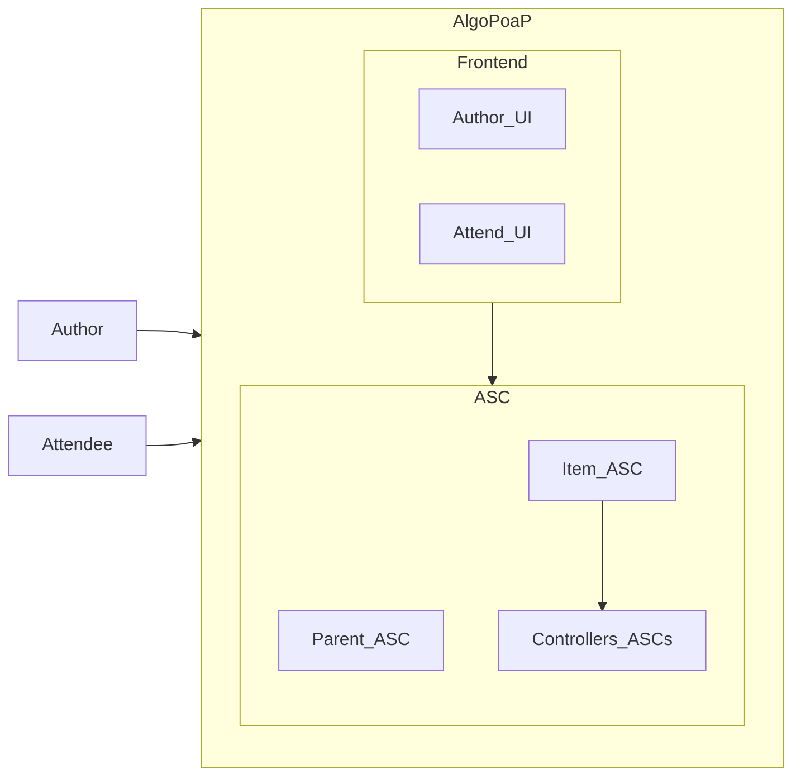
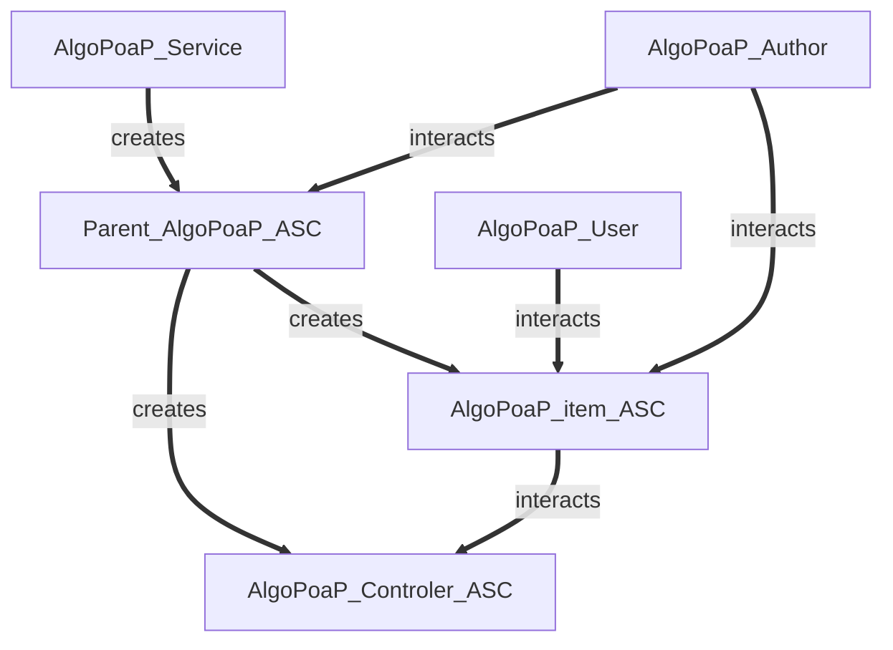
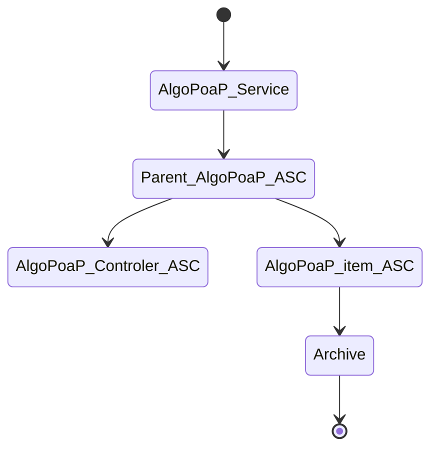

# AlgoPoaP
### **AlgoPoaP** is the Proof of Attendance Protocol built on Algorand (AVM V1.1) which aims to be elevated into a Proof Of Anything Protocol in future (with use of coming state proofs feature on Algorand).

The original idea of PoaP on blockchain is developed for Etherium ecosystem and is Token based and lacks many features. **AlgoPoaP** elevates, extends and expands that original idea and implements it on Algorand. 

**AlgoPoaP** dApp is consisted of a frontend calling an Algorand ASC system in which ASCs use each other via C2C calls introduced in Algorand AVM V1.1

----

----

## AlgoPoaP's frontend application and landing page, SPA-PWA:

- [AlgoPoaP's Smart Contracts Repository](https://github.com/AlgoPoaP/algopoap-smartcontracts)

- [AlgoPoaP's Frontend Repository](https://github.com/AlgoPoaP/algopoap)

** Both will be public soon, WIP! **

**AlgoPoaP** features that are not available on ETH PoaP:

- Geo
- Tokenless
- Parametrized NFT
- Signature
- QRCode

**AlgoPoaP** frontend has 3 major functions:
- Wallet Session
- Author UI
- Attend UI

## AlgoPoaP Smart Contracts 

AlgoPoaP ASC System is designed on basis of newest TEAL features came with TEAL v 6.0 on AVM V1.1. AlgoPoaP Parent contract is created and thereafter every AlgoPoaP item is created by this parent contract based on configurations needed.

----
### Entities Relations:

----
### Lifecycle:

----
### UseCase:

Since AlgoPoaP is totally decentralized, trustless and permissionless: Every AlgoPoaP item author has full authority of the created PoaPs (AlgoPoaP-DAO is coming with dao, voting and governance features in near future, after startup formation. Preferably I will use integration to an already working service with ABI)!

The algopoap_contract.json contains the ABI Schema for parent AlgoPoaP contract and algopoap_item_contract.json is the full ABI Schema of AlgoPoaP item contract which will be created by an C2C call via an inner transaction.

