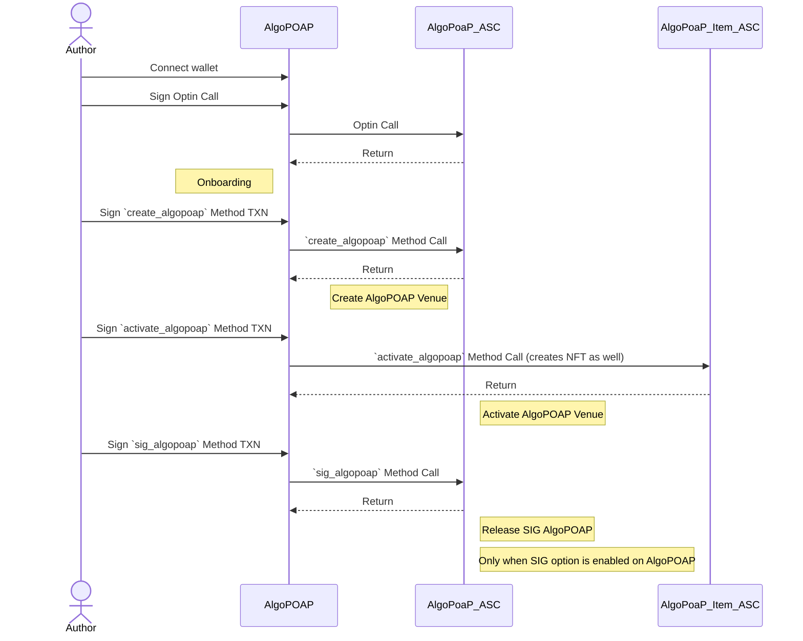
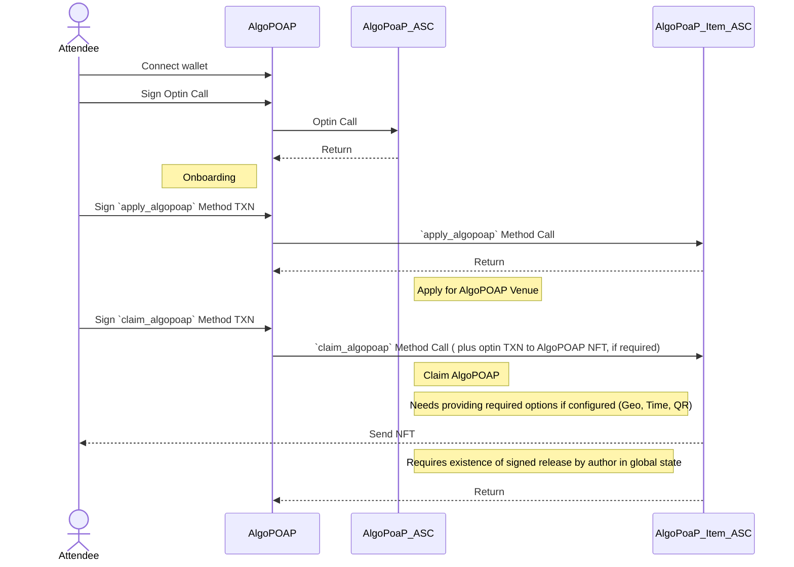
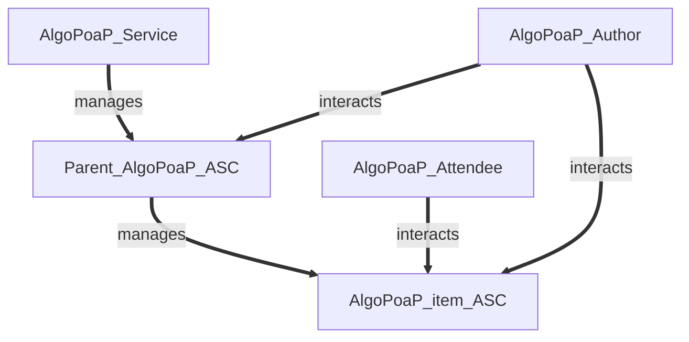
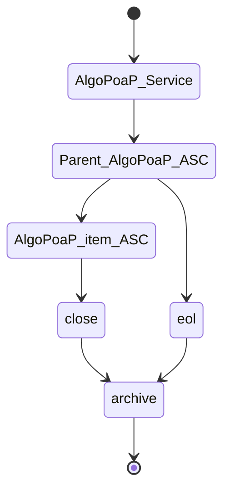
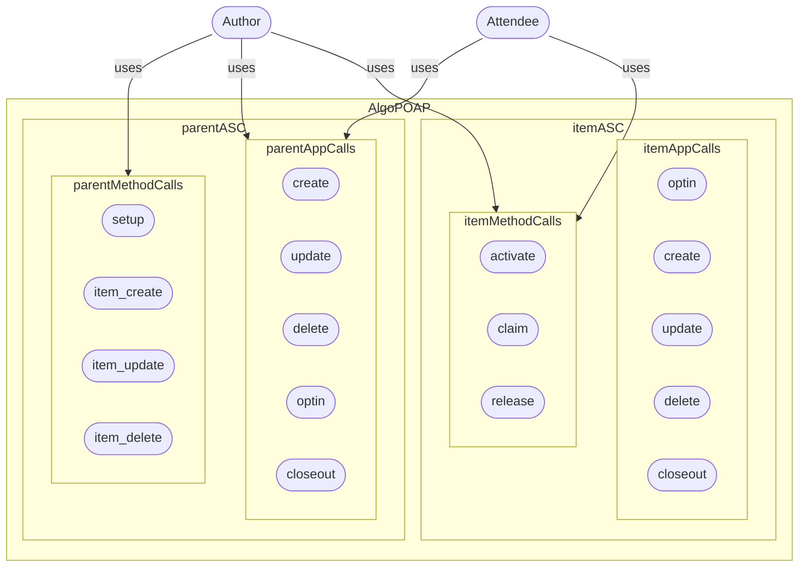
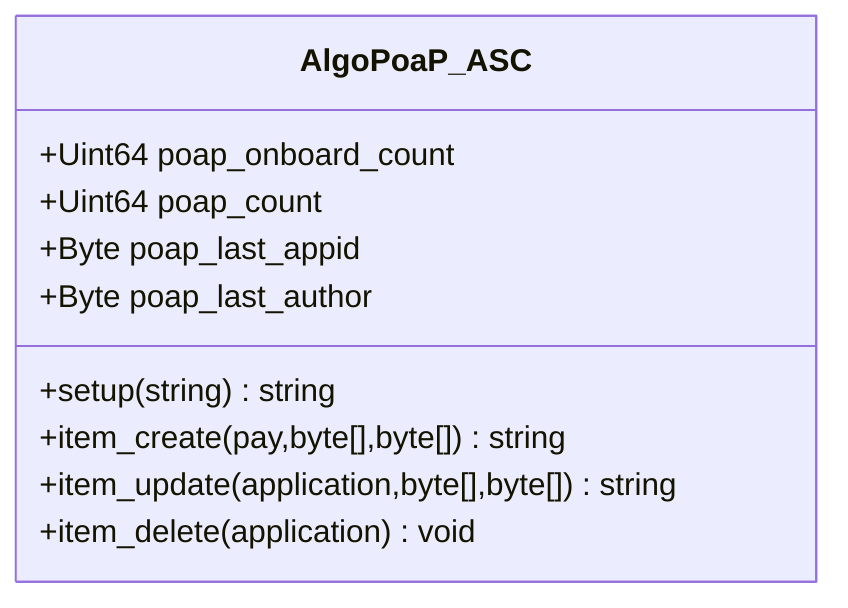
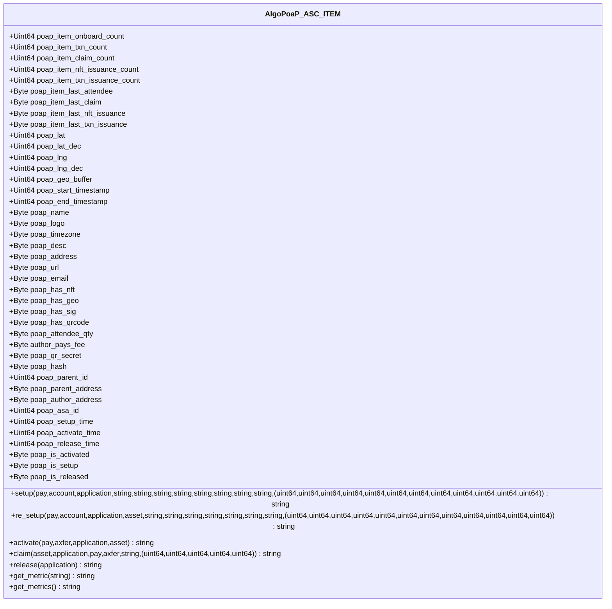

# AlgoPOAP


### This documentation is subject to update for newer updates please refer to [AlgoPOAP FAQ](https://algopoap.gitbook.io/algopoap/)
### AlgoPOAP is the Proof Of Anything Protocol on [Algorand](https://algorand.com) (AVM8), aiming at being extended into a Muti-Chain Protocol in future using Algorand State Proofs.

- [AlgoPOAP Concept](#algopoap-concept)

- [AlgoPOAP Links](#algopoap-links)

- [AlgoPOAP Repos](#algopoap-code-repositories)
  
- [AlgoPOAP Credits](#algopoap-credits)

- [AlgoPOAP Technical Design](#algopoap-technical-design)
  - [Author's Journey](#authors-journey)
  - [Attendee's Journey](#attendees-journey)
  - [Smart Contracts](#algopoap-smart-contracts)

## AlgoPOAP links
[top↑](#algopoap)

- [AlgoPOAP Github Repos & Documentation](https://github.com/AlgoPOAP)

- [AlgoPOAP Website (algopoap.com)](https://algopoap.com)

- [AlgoPOAP dApp (algopoap.xyz)](https://algopoap.xyz)

- [AlgoPOAP TESTNET dApp (testnet.algopoap.xyz)](https://testnet.algopoap.xyz)
 
- [Algorand NFDomain (algopoap.algo)](https://app.nf.domains/name/algopoap.algo)

## AlgoPOAP public code repositories:
[top↑](#algopoap)

- [AlgoPOAP's Smart Contracts Repository](https://github.com/AlgoPOAP/algopoap-smartcontracts)


## AlgoPOAP concept:
[top↑](#algopoap)


AlgoPOAP dApp is consisted of a frontend calling an Algorand ASC system in which ASCs use each other via inner transactions and C2C calls.

AlgoPOAP complies to [ARC3](https://github.com/algorandfoundation/ARCs/blob/main/ARCs/arc-0003.md) and [ARC4](https://github.com/algorandfoundation/ARCs/blob/main/ARCs/arc-0004.md) living standards on Algorand.


## Geo considerations:

Geo approximations on latitude and longitude unit changes (4 decimal place unit e.g. 0.0001):

- The latitude unit of change per 0.0001 change ~ 11 meters
- For longitude, the simplified approximation is used based on this schema generated using Geolib library (distance in meters per 0.0001 lng change on specific lat range).
  
```javascript
[
  {
    "lat": 0,
    "distance": 11
  },
  {
    "lat": 20,
    "distance": 10
  },
  {
    "lat": 32,
    "distance": 9
  },
  {
    "lat": 41,
    "distance": 8
  },
  {
    "lat": 48,
    "distance": 7
  },
  {
    "lat": 55,
    "distance": 6
  },
  {
    "lat": 61,
    "distance": 5
  },
  {
    "lat": 67,
    "distance": 4
  },
  {
    "lat": 72,
    "distance": 3
  },
  {
    "lat": 78,
    "distance": 2
  },
  {
    "lat": 83,
    "distance": 1
  },
  {
    "lat": 88,
    "distance": 0
  }
]

```
Latitudes are "parallels" while longitudes are "meridians" that all meet at the poles. For latitude, there is a set distance traveled per degree latitude no matter where you are on a spherical globe. For longitude, it depends what latitude you are at.

[Use this link to play around distance change per unit of lng on each lat](https://www.movable-type.co.uk/scripts/latlong.html)


----

## AlgoPOAP Credits
[top↑](#algopoap)

@emg110 and @sheghzo are grateful to Algorand Inc and Algorand Foundation for everything!

And special thanks to all AlgoPOAP Slack channel distinguished members for great ideas and comments which we used in AlgoPOAP.


# AlgoPOAP technical design:
[top↑](#algopoap)

AlgoPOAP features :

- Geo constraint option (Geofencing using location + area radius ).
  
- Authorization Signature constraint option (Author must sign the release before AlgoPOAP issuance for claimed Attendees).
  
- Shared Secret constraint option (Attendee must scan a QRCode during calling the AlgoPOAP Item ASC with it in order to claim successfully).
  
- Dynamic NFTs per AlgoPOAP item (AlgoPOAP is 100% token-less and NFTs are generated and owned by AlgoPOAP item contract and that belongs to AlgoPOAP item's author).
  


AlgoPOAP is consisted of a frontend and smart contracts on Algorand chain:
- Frontend
- Smart Contracts


AlgoPOAP frontend has 3 major functions (all in a single view for simplicity):
- Wallet Session
- Author UI
- Attend UI

Note: Frontend will be available through both cloudflare (heavily distributed on edge) and IPFS to ensure decentralization (with transparent routing for best UX).


----

### Author's Journey:
[top↑](#algopoap)

1- Author easily gets onboard by opting into AlgoPOAP's parent ASC.

2- Then can create a new AlgoPOAP venue.

3- Then activate the venue to let claims begin (This differs than start time option of AlgoPOAP).

Note : If SIG is not enabled for AlgoPOAP Venue, Claim approval will send AlgoPOAP NFT or TXN to Attendee's wallet but if SIG is enabled then after signing of Author, AlgoPOAP NFT or TXN will be sent automatically to attendee's wallet, after author signs and sends a release method call transaction to release all successfully claimed AlgoPOAP attendees. 

Options available for AlgoPOAP creation:

- Time (default enabled): Start time check (compared to LatestTimestamp)
- Geo: Location point check to be inside a geofence with desired radius (in meters with min of 5m and max of 1000m).
- Signature: Author's signature is needed to make AlgoPOAP claimable for every attendee, individually. Each and every attendee can receive their single claimed AlgoPOAP (in NFT or TXN depending on AlgoPOAP config) only after Author's authorization via a successful method call (which obviously should happen after both venue activation and venue start time). 
- QRCode: Upon activation a secret key will be generated and included in a transaction as a method input parameter and this TXN is then communicated by a QRCode in venue location and Attendee scans this QRCode during physical presence and claims (other arguments will be added to this raw transaction object after scan and when claiming).

Note: QRCode feature is still under heavy re-ideation, re-design and re-everything! So please, kindly consider it WIP and FUTURE release functionality!



----
### Attendee's Journey:
[top↑](#algopoap)

1- Attendee simply gets onboard by opting into parent ASC.

2- Then get a searchable list of AlgoPOAP venues and applys to one by opting into it.

3- Then after general venue activation (by author) and by satisfying what AlgoPOAP venue options require, claim the AlgoPOAP and get AlgoPOAP NFT if approved.

Note : If SIG is not enabled for AlgoPOAP Venue, Claim approval will send AlgoPOAP NFT to Attendee's wallet but if SIG is enabled then after signing of Author, it'l be sent automatically to attendee's wallet.



----

## AlgoPOAP Smart Contracts 
[top↑](#algopoap)

AlgoPOAP ASC System is designed on basis of newest TEAL features came with TEAL v 8.0 on AVM8. AlgoPOAP Parent contract is created and thereafter every AlgoPOAP item is created by this parent contract based on configurations needed.

All methods expenses and fee details are in following table (those not in this table have just normal 1 MinFee):

Note: This section (Fees) is subject to further updates and changes and is work in progress!

| Method | Fee           | Amount|
| ------------- |:-------------:| -----:|
| New AlgoPOAP                     | 1 MinFee      |   2 MinFee |
| Setup AlgoPOAP                   | 1 MinFee      |   1 MinFee |
| Activate AlgoPOAP(Author pays)   | 3 MinFee      |   Attendee_Qty * 4 * MinFee |
| Activate AlgoPOAP(Attendee pays) | 3 MinFee      |   1 MinFee |
| Release AlgoPOAP| 1 MinFee       | 1 MinFee      |   0  |
| Claim AlgoPOAP(Author pays)      | 1 MinFee      |   0  |
| Claim AlgoPOAP(Attendee pays)    | 4 MinFee      |   0  |

----

### Entities Relations:



----

### Lifecycle:


----


### UseCase:

**Note: The NoOp calls without args will be rejected with error. This is being examined as a security practice**


----

### AlgoPOAP ASC TEAL Graph:
[top↑](#algopoap)


----

### AlgoPOAP ASC ABI :
[top↑](#algopoap)

Note 1: Data fields are global states of AlgoPOAP parent smart contract.

Note 2: Fee collection is not included anywhere at this phase of AlgoPOAP MVP development but certainly is a priority prior to public TESTNET deployment. It happens on parent smart contract.


Note 3: Author user has all metrics in localState of AlgoPOAP Item smart contract and all Authored AlgoPoaPs (upt to 16 item) in localState of AlgoPOAP smart contract (parent) 

----

### AlgoPOAP ASC ABI Schema :
[top↑](#algopoap)

```javascript
{
  "name":"algopoap-contract",
  "desc": "AlgoPOAP Parent smart contract",
  "networks":{
      "MainNet":{
          "appID": 0
      },
      "TestNet":{
          "appID": 0
      }
  },
  "methods":[
    {
          "name": "setup",
          "args": [
            {
              "type": "string",
              "name": "version"
            }
          ],
          "returns": {
            "type": "string"
          },
          "desc": "Sets up the AlgoPOAP main contract, sets and logs the version and returns"
        },
      {
          "name": "item_create",
          "args": [
            {
              "type": "pay",
              "name": "pay"
            },
            {
              "type": "byte[]",
              "name": "asc_approval_bytes"
            },
            {
              "type": "byte[]",
              "name": "asc_clear_bytes"
            }
          ],
          "returns": {
            "type": "string"
          },
          "desc": "Creates a new AlgoPOAP item smart contract and returns the app id"
        },
        {
          "name": "item_update",
          "args": [
            {
              "type": "application",
              "name": "application"
            },
            {
              "type": "byte[]",
              "name": "asc_approval_bytes"
            },
            {
              "type": "byte[]",
              "name": "asc_clear_bytes"
            }
          ],
          "returns": {
            "type": "string"
          },
          "desc": "Updates an AlgoPOAP item smart contract and returns item application ID"
        },
        {
          "name": "item_delete",
          "args": [
            {
              "type": "application",
              "name": "application"
            }
          ],
          "returns": {
            "type": "void"
          },
          "desc": "Deletes an AlgoPOAP item smart contract and returns void (approve only)"
        }
  ]
}

```
----

### AlgoPOAP Item ASC TEAL Graph:
[top↑](#algopoap)


----

### AlgoPOAP ASC ITEM ABI :
[top↑](#algopoap)

Note 1: Data fields are global states of AlgoPOAP item smart contract.



----

### AlgoPOAP ASC ITEM ABI Schema :
[top↑](#algopoap)

```javascript
{
    "name": "algopoap-item-contract",
    "desc": "AlgoPOAP Item smart contract",
    "networks": {
        "MainNet": {
            "appID": 0
        },
        "TestNet": {
            "appID": 109691598
        }
    },
    "methods": [
        {
            "name": "setup",
            "args": [
                {
                    "type": "pay",
                    "name": "pay_min_fee"
                },
                {
                    "type": "account",
                    "name": "author_account"
                },
                {
                    "type": "application",
                    "name": "parent_application"
                },
                {
                    "type": "string",
                    "name": "reserved"
                },
                {
                    "type": "string",
                    "name": "poap_name"
                },
                {
                    "type": "string",
                    "name": "poap_logo"
                },
                {
                    "type": "string",
                    "name": "poap_desc"
                },
                {
                    "type": "string",
                    "name": "poap_timezone"
                },
                {
                    "type": "string",
                    "name": "poap_address"
                },
                {
                    "type": "string",
                    "name": "poap_url"
                },
                {
                    "type": "string",
                    "name": "poap_email"
                },
                {
                    "type": "(uint64,uint64,uint64,uint64,uint64,uint64,uint64,uint64,uint64,uint64,uint64,uint64)",
                    "name": "poap_uint64_tuple"
                }
            ],
            "returns": {
                "type": "string"
            },
            "desc": "Sets up an AlgoPOAP smart contract item for the first time"
        },
        {
            "name": "activate",
            "args": [
                {
                    "type": "pay",
                    "name": "pay_min_fees"
                },
                {
                    "type": "axfer",
                    "name": "optin_algopoap_nft"
                },
                {
                    "type": "application",
                    "name": "parent_application"
                },
                {
                    "type": "asset",
                    "name": "nft_asa"
                }
            ],
            "returns": {
                "type": "string"
            },
            "desc": "Activates an AlgoPOAP item smart contract and returns string"
        },
        {
            "name": "claim",
            "args": [
                {
                    "type": "pay",
                    "name": "pay_min_fee"
                },
                {
                    "type": "asset",
                    "name": "nft_asset"
                },
                {
                    "type": "application",
                    "name": "parent_application"
                },
                {
                    "type": "account",
                    "name": "attendee_account"
                },
                {
                    "type": "string",
                    "name": "qr_secret"
                },
                {
                    "type": "(uint64,uint64,uint64,uint64,uint64)",
                    "name": "claim_uint64_tuple"
                }
            ],
            "returns": {
                "type": "string"
            },
            "desc": "Claims an AlgoPOAP for an attendee and returns NFT sending inner-transaction hash"
        },
        {
            "name": "release",
            "args": [
                {
                    "type": "application",
                    "name": "parent_contract"
                }
            ],
            "returns": {
                "type": "string"
            },
            "desc": "Releases AlgoPOAP and allows all AlgoPOAP attendee's to start claiming"
        }
    ]
}

```
----

Since AlgoPOAP is totally decentralized, trustless and permission-less: Every AlgoPOAP item author has full authority of the created PoaPs (AlgoPOAP-DAO is coming with dao, voting and governance features in near future, after startup formation. Preferably I will use integration to an already working service with ABI)!

The algopoap_contract.json contains the ABI Schema for parent AlgoPOAP contract and algopoap_item_contract.json is the full ABI Schema of AlgoPOAP item contract which will be created via an inner transaction.


### Simple basic deployment and unit tests included

Note: These are available under [AlgoPOAP's Smart Contracts Repository](https://github.com/AlgoPOAP/algopoap-smartcontracts) and more unit test scenarios are to be added for audit process.

```shell
> algopoap-smartcontracts@0.0.4 start
[ALGOPOAP: ] [2022-08-30T16:26:36.462Z] [info]: ------------------------------
[ALGOPOAP: ] [2022-08-30T16:26:36.463Z] [info]: AlgoPOAP Item Contract ABI Exec method = ABIMethod {
  name: 'item_update',
  description: 'Updates an AlgoPOAP item smart contract and returns item application ID',
  args: [Array],
  returns: [Object]
}
[ALGOPOAP: ] [2022-08-30T16:26:42.933Z] [info]: AlgoPOAP Main Contract ABI Exec method result = 107325601
[ALGOPOAP: ] [2022-08-30T16:26:43.294Z] [info]: ------------------------------
[ALGOPOAP: ] [2022-08-30T16:26:43.295Z] [info]: AlgoPOAP Item Contract ABI Exec method = ABIMethod {
  name: 're_setup',
  description: 'Sets up an AlgoPOAP smart contract item after first setup',
  args: [Array],
  returns: [Object]
}
[ALGOPOAP: ] [2022-08-30T16:26:51.351Z] [info]: AlgoPOAP Main Contract ABI Exec method result = 107325874
[ALGOPOAP: ] [2022-08-30T16:26:51.786Z] [info]: ------------------------------
[ALGOPOAP: ] [2022-08-30T16:26:51.786Z] [info]: AlgoPOAP Item Contract ABI Exec method = ABIMethod {
  name: 'activate',
  description: 'Activates an AlgoPOAP item smart contract and returns string',
  args: [Array],
  returns: [Object]
}
[ALGOPOAP: ] [2022-08-30T16:26:59.712Z] [info]: AlgoPOAP Main Contract ABI Exec method result = algopoap_item_activate
[ALGOPOAP: ] [2022-08-30T16:27:00.134Z] [info]: ------------------------------
[ALGOPOAP: ] [2022-08-30T16:27:00.134Z] [info]: AlgoPOAP Item Contract ABI Exec method = ABIMethod {
  name: 'release',
  description: "Releases AlgoPOAP and allows all AlgoPOAP attendee's to start claiming",
  args: [Array],
  returns: [Object]
}
[ALGOPOAP: ] [2022-08-30T16:27:07.941Z] [info]: AlgoPOAP Main Contract ABI Exec method result = algopoap_item_released
[ALGOPOAP: ] [2022-08-30T16:27:08.290Z] [info]: ------------------------------
[ALGOPOAP: ] [2022-08-30T16:27:08.291Z] [info]: AlgoPOAP Item Contract ABI Exec method = ABIMethod {
  name: 'claim',
  description: 'Claims an AlgoPOAP for an attendee and returns NFT sending inner-transaction hash',
  args: [Array],
  returns: [Object]
}
[ALGOPOAP: ] [2022-08-30T16:27:16.355Z] [info]: AlgoPOAP Main Contract ABI Exec method result = algopoap_item_claimed


```


