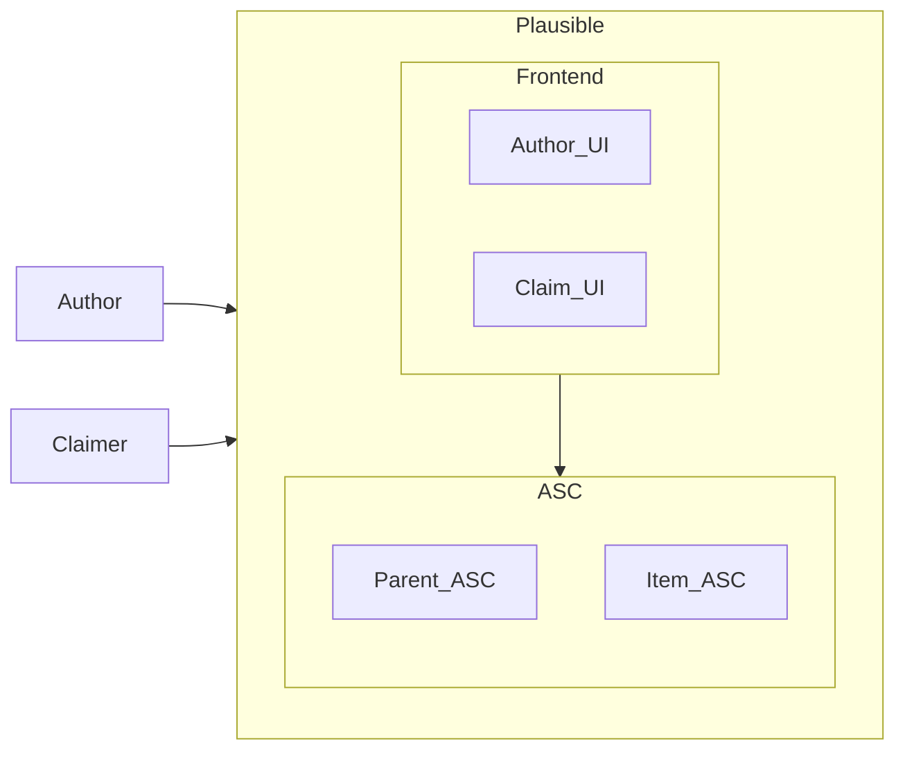
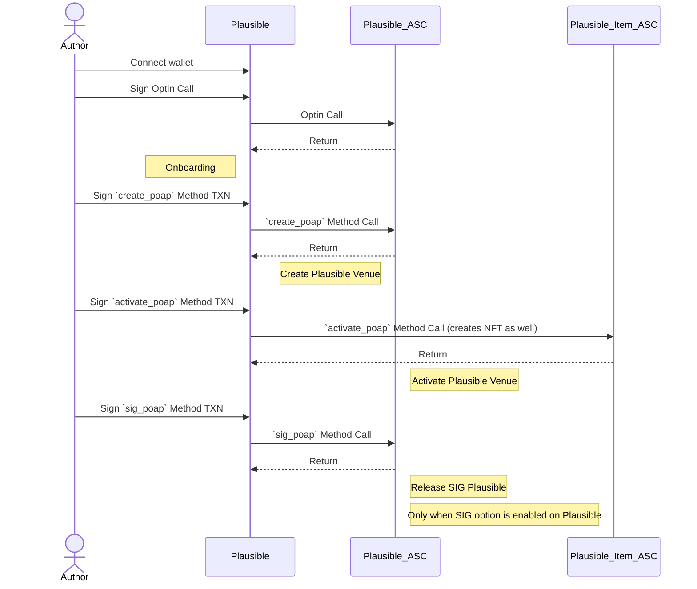
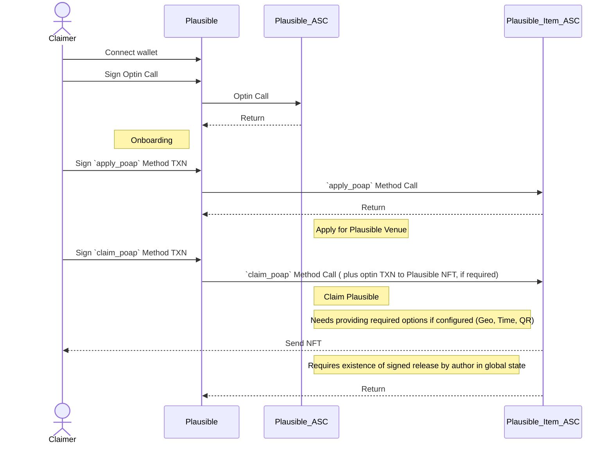
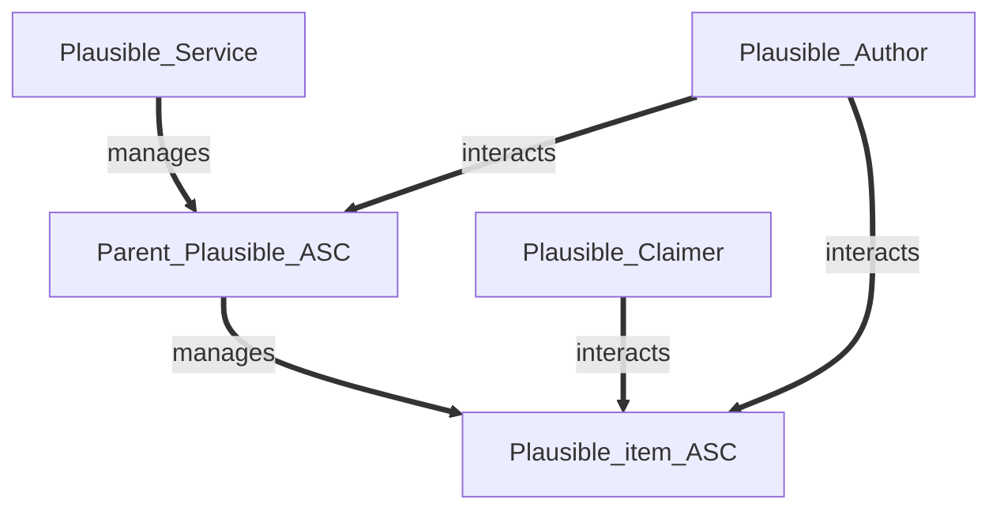
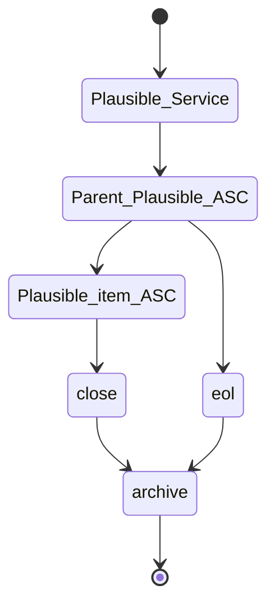
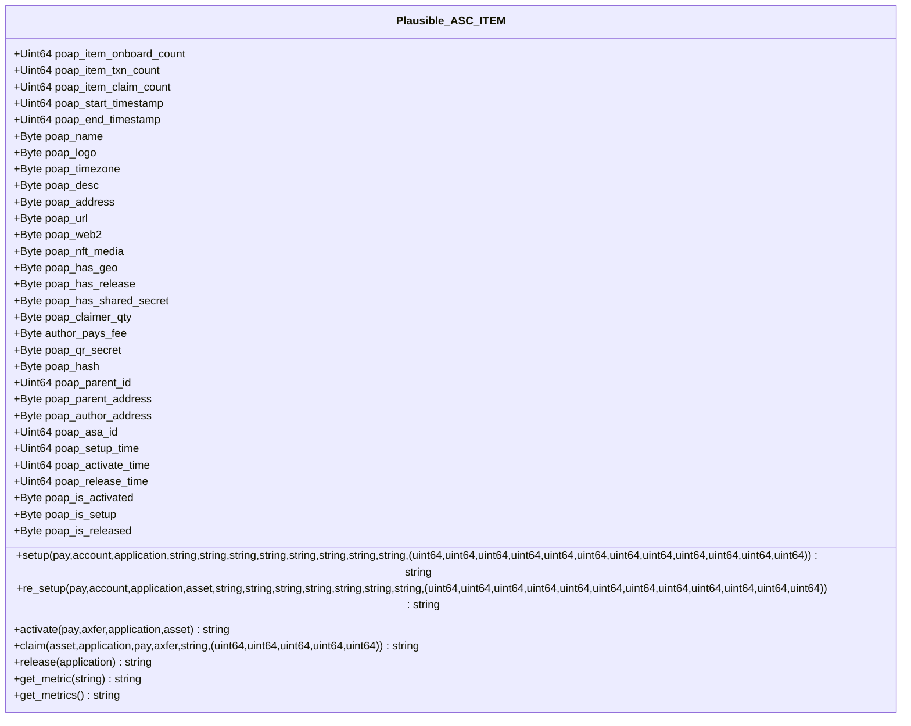

# Plausible
### Formerly Plausible


### This documentation is subject to update for newer updates please refer to [Plausible FAQ](https://goplausible.gitbook.io/goplausible/)
### Plausible is the Proof Of Anything Protocol on [Algorand](https://algorand.com) (AVM8), aiming at being extended into a Muti-Chain Protocol in future using Algorand State Proofs.

- [Plausible Concept](#plausible-concept)

- [Plausible Links](#plausible-links)

- [Plausible Repos](#plausible-code-repositories)
  
- [Plausible gratitudes](#plausible-credits)

- [Plausible Technical Design](#plausible-technical-design)
  - [Author's Journey](#authors-journey)
  - [Claimer's Journey](#claimers-journey)
  - [Smart Contracts](#plausible-smart-contracts)

## Plausible links
[top↑](#plausible)

- [Plausible Github Repos & Documentation](https://github.com/GoPlausible)

- [Plausible Website (plausible.com)](https://goplausible.com)

- [Plausible dApp (plausible.xyz)](https://goplausible.xyz)

- [Plausible TESTNET dApp (testnet.plausible.xyz)](https://testnet.goplausible.xyz)
 
- [Algorand NFDomain (plausible.algo)](https://app.nf.domains/name/plausible.algo)


## Plausible concept:
[top↑](#plausible)


Plausible dApp is consisted of a frontend calling an Algorand ASC system in which ASCs use each other via inner transactions and C2C calls.

Plausible complies to [ARC3](https://github.com/algorandfoundation/ARCs/blob/main/ARCs/arc-0003.md) and [ARC4](https://github.com/algorandfoundation/ARCs/blob/main/ARCs/arc-0004.md) living standards on Algorand.


## Plausible Gratitudes
[top↑](#plausible)

@emg110 and @sheghzo are grateful to Algorand Inc, Algorand Foundation, Algorand Ecosystem and AXL Ventures!

And special thanks to all Plausible Slack channel distinguished members for great ideas and comments which we used in Plausible.


# Plausible technical design:
[top↑](#plausible)

Plausible features :

- Geo constraint option (Geofencing using connecting ISP country and allow and ban lists ).
  
- Authorization Signature constraint option (Author must sign the release before Plausible issuance for claimed claimers).
  
- Shared Secret constraint option (Claimer must scan a QRCode during calling the Plausible Item ASC with it in order to claim successfully).
  
- Dynamic NFTs per Plausible item (Plausible is 100% token-less and NFTs are generated and owned by Plausible item contract and that belongs to Plausible item's author).
  


Plausible is consisted of a frontend and smart contracts on Algorand chain:
- Frontend
- Smart Contracts


Plausible frontend has 3 major functions (all in a single view for simplicity):
- Wallet Session
- Author UI
- Claim UI

Note: Frontend will be available through both cloudflare (heavily distributed on edge) and IPFS to ensure decentralization (with transparent routing for best UX).




----

### Author's Journey:
[top↑](#plausible)

1- Author easily gets onboard by opting into Plausible's parent ASC.

2- Then can create a new Plausible venue.

3- Then activate the venue to let claims begin (This differs than start time option of Plausible).

Note : If SIG is not enabled for Plausible Venue, Claim approval will send Plausible NFT or TXN to Claimer's wallet but if SIG is enabled then after signing of Author, Plausible NFT or TXN will be sent automatically to Claimer's wallet, after author signs and sends a release method call transaction to release all successfully claimed Plausible Claimer. 

Options available for Plausible creation:

- Time (default enabled): Start time check (compared to LatestTimestamp)
- Geo: Country allow and ban lists.
- Signature: Author's signature is needed to make Plausible claimable for every Claimer, individually. Each and every Claimer can receive their single claimed Plausible (in NFT or TXN depending on Plausible config) only after Author's authorization via a successful method call (which obviously should happen after both venue activation and venue start time). 
- QRCode: Upon activation a secret key will be generated and included in a transaction as a method input parameter and this TXN is then communicated by a QRCode in venue location and Claimer scans this QRCode during physical presence and claims (other arguments will be added to this raw transaction object after scan and when claiming).

Note: QRCode feature is still under heavy re-ideation, re-design and re-everything! So please, kindly consider it WIP and FUTURE release functionality!



----
### Claimer's Journey:
[top↑](#plausible)

1- Claimer simply gets onboard by opting into parent ASC.

2- Then get a searchable list of Plausible venues and applys to one by opting into it.

3- Then after general venue activation (by author) and by satisfying what Plausible venue options require, claim the Plausible and get Plausible NFT if approved.

Note : If SIG is not enabled for Plausible Venue, Claim approval will send Plausible NFT to Claimer's wallet but if SIG is enabled then after signing of Author, it'l be sent automatically to Claimer's wallet.



----

## Plausible Smart Contracts 
[top↑](#plausible)

Plausible ASC System is designed on basis of newest TEAL features came with TEAL v 8.0 on AVM8. Plausible Parent contract is created and thereafter every Plausible item is created by this parent contract based on configurations needed.

All methods expenses and fee details are in following table (those not in this table have just normal 1 MinFee):

Note: This section (Fees) is subject to further updates and changes and is work in progress!

| Method | Fee           | Amount|
| ------------- |:-------------:| -----:|
| New Plausible                     | 1 MinFee      |   2 MinFee |
| Setup Plausible                   | 1 MinFee      |   1 MinFee |
| Activate Plausible(Author pays)   | 3 MinFee      |   Claimer_Qty * 4 * MinFee |
| Activate Plausible(Claimer pays) | 3 MinFee      |   1 MinFee |
| Release Plausible| 1 MinFee       | 1 MinFee      |   0  |
| Claim Plausible(Author pays)      | 1 MinFee      |   0  |
| Claim Plausible(Claimer pays)    | 4 MinFee      |   0  |

----

### Entities Relations:



----

### Lifecycle:


----


### UseCase:

**Note: The NoOp calls without args will be rejected with error. This is being examined as a security practice**


----

### Plausible ASC TEAL Graph:
[top↑](#plausible)


----

### Plausible ASC ABI :
[top↑](#plausible)

Note 1: Data fields are global states of Plausible parent smart contract.

Note 2: Fee collection is not included anywhere at this phase of Plausible MVP development but certainly is a priority prior to public TESTNET deployment. It happens on parent smart contract.


Note 3: Author user has all metrics in localState of Plausible Item smart contract and all Authored Plausibles (upt to 16 item) in localState of Plausible smart contract (parent) 

----

### Plausible ASC ABI Schema :
[top↑](#plausible)

```javascript
{
  "name":"plausible-contract",
  "desc": "Plausible Parent smart contract",
  "networks":{
      "MainNet":{
          "appID": 0
      },
      "TestNet":{
          "appID": 0
      }
  },
  "methods":[
    {
          "name": "setup",
          "args": [
            {
              "type": "string",
              "name": "version"
            }
          ],
          "returns": {
            "type": "string"
          },
          "desc": "Sets up the Plausible main contract, sets and logs the version and returns"
        },
      {
          "name": "item_create",
          "args": [
            {
              "type": "pay",
              "name": "pay"
            },
            {
              "type": "byte[]",
              "name": "asc_approval_bytes"
            },
            {
              "type": "byte[]",
              "name": "asc_clear_bytes"
            }
          ],
          "returns": {
            "type": "string"
          },
          "desc": "Creates a new Plausible item smart contract and returns the app id"
        },
        {
          "name": "item_update",
          "args": [
            {
              "type": "application",
              "name": "application"
            },
            {
              "type": "byte[]",
              "name": "asc_approval_bytes"
            },
            {
              "type": "byte[]",
              "name": "asc_clear_bytes"
            }
          ],
          "returns": {
            "type": "string"
          },
          "desc": "Updates an Plausible item smart contract and returns item application ID"
        },
        {
          "name": "item_delete",
          "args": [
            {
              "type": "application",
              "name": "application"
            }
          ],
          "returns": {
            "type": "void"
          },
          "desc": "Deletes an Plausible item smart contract and returns void (approve only)"
        }
  ]
}

```
----

### Plausible Item ASC TEAL Graph:
[top↑](#plausible)


----

### Plausible ASC ITEM ABI :
[top↑](#plausible)

Note 1: Data fields are global states of Plausible item smart contract.



----

### Plausible ASC ITEM ABI Schema :
[top↑](#plausible)

```javascript
{
    "name": "plausible-item-contract",
    "desc": "Plausible Item smart contract",
    "networks": {
        "MainNet": {
            "appID": 0
        },
        "TestNet": {
            "appID": 109691598
        }
    },
    "methods": [
        {
            "name": "setup",
            "args": [
                {
                    "type": "pay",
                    "name": "pay_min_fee"
                },
                {
                    "type": "account",
                    "name": "author_account"
                },
                {
                    "type": "application",
                    "name": "parent_application"
                },
                {
                    "type": "string",
                    "name": "reserved"
                },
                {
                    "type": "string",
                    "name": "poap_name"
                },
                {
                    "type": "string",
                    "name": "poap_logo"
                },
                {
                    "type": "string",
                    "name": "poap_desc"
                },
                {
                    "type": "string",
                    "name": "poap_timezone"
                },
                {
                    "type": "string",
                    "name": "poap_address"
                },
                {
                    "type": "string",
                    "name": "poap_url"
                },
                {
                    "type": "string",
                    "name": "poap_web2"
                },
                {
                    "type": "(uint64,uint64,uint64,uint64,uint64,uint64,uint64,uint64,uint64,uint64,uint64,uint64)",
                    "name": "poap_uint64_tuple"
                }
            ],
            "returns": {
                "type": "string"
            },
            "desc": "Sets up an Plausible smart contract item for the first time"
        },
        {
            "name": "activate",
            "args": [
                {
                    "type": "pay",
                    "name": "pay_min_fees"
                },
                {
                    "type": "axfer",
                    "name": "optin_poap_nft"
                },
                {
                    "type": "application",
                    "name": "parent_application"
                },
                {
                    "type": "asset",
                    "name": "nft_asa"
                }
            ],
            "returns": {
                "type": "string"
            },
            "desc": "Activates an Plausible item smart contract and returns string"
        },
        {
            "name": "claim",
            "args": [
                {
                    "type": "pay",
                    "name": "pay_min_fee"
                },
                {
                    "type": "asset",
                    "name": "nft_asset"
                },
                {
                    "type": "application",
                    "name": "parent_application"
                },
                {
                    "type": "account",
                    "name": "claimer_account"
                },
                {
                    "type": "string",
                    "name": "qr_secret"
                },
                {
                    "type": "(uint64,uint64,uint64,uint64,uint64)",
                    "name": "claim_uint64_tuple"
                }
            ],
            "returns": {
                "type": "string"
            },
            "desc": "Claims an Plausible for a claimer and returns NFT sending inner-transaction hash"
        },
        {
            "name": "release",
            "args": [
                {
                    "type": "application",
                    "name": "parent_contract"
                }
            ],
            "returns": {
                "type": "string"
            },
            "desc": "Releases Plausible and allows all Plausible claimer's to start claiming"
        }
    ]
}

```
----

Since Plausible is totally decentralized, trustless and permission-less: Every Plausible item author has full authority of the created PoaPs (Plausible-DAO is coming with dao, voting and governance features in near future, after startup formation. Preferably I will use integration to an already working service with ABI)!

The poap_contract.json contains the ABI Schema for parent Plausible contract and poap_item_contract.json is the full ABI Schema of Plausible item contract which will be created via an inner transaction.


### Simple basic deployment and unit tests included

Note: These are available under [Plausible's Smart Contracts Repository](https://github.com/Plausible/plausible-smartcontracts) and more unit test scenarios are to be added for audit process.

```shell
> plausible-smartcontracts@0.0.4 start
[PLAUSIBLE: ] [2022-08-30T16:26:36.462Z] [info]: ------------------------------
[PLAUSIBLE: ] [2022-08-30T16:26:36.463Z] [info]: Plausible Item Contract ABI Exec method = ABIMethod {
  name: 'item_update',
  description: 'Updates an Plausible item smart contract and returns item application ID',
  args: [Array],
  returns: [Object]
}
[PLAUSIBLE: ] [2022-08-30T16:26:42.933Z] [info]: Plausible Main Contract ABI Exec method result = 107325601
[PLAUSIBLE: ] [2022-08-30T16:26:43.294Z] [info]: ------------------------------
[PLAUSIBLE: ] [2022-08-30T16:26:43.295Z] [info]: Plausible Item Contract ABI Exec method = ABIMethod {
  name: 're_setup',
  description: 'Sets up an Plausible smart contract item after first setup',
  args: [Array],
  returns: [Object]
}
[PLAUSIBLE: ] [2022-08-30T16:26:51.351Z] [info]: Plausible Main Contract ABI Exec method result = 107325874
[PLAUSIBLE: ] [2022-08-30T16:26:51.786Z] [info]: ------------------------------
[PLAUSIBLE: ] [2022-08-30T16:26:51.786Z] [info]: Plausible Item Contract ABI Exec method = ABIMethod {
  name: 'activate',
  description: 'Activates an Plausible item smart contract and returns string',
  args: [Array],
  returns: [Object]
}
[PLAUSIBLE: ] [2022-08-30T16:26:59.712Z] [info]: Plausible Main Contract ABI Exec method result = poap_item_activate
[PLAUSIBLE: ] [2022-08-30T16:27:00.134Z] [info]: ------------------------------
[PLAUSIBLE: ] [2022-08-30T16:27:00.134Z] [info]: Plausible Item Contract ABI Exec method = ABIMethod {
  name: 'release',
  description: "Releases Plausible and allows all Plausible claimers to start claiming",
  args: [Array],
  returns: [Object]
}
[PLAUSIBLE: ] [2022-08-30T16:27:07.941Z] [info]: Plausible Main Contract ABI Exec method result = poap_item_released
[PLAUSIBLE: ] [2022-08-30T16:27:08.290Z] [info]: ------------------------------
[PLAUSIBLE: ] [2022-08-30T16:27:08.291Z] [info]: Plausible Item Contract ABI Exec method = ABIMethod {
  name: 'claim',
  description: 'Claims an Plausible for a claimer and returns NFT sending inner-transaction hash',
  args: [Array],
  returns: [Object]
}
[PLAUSIBLE: ] [2022-08-30T16:27:16.355Z] [info]: Plausible Main Contract ABI Exec method result = poap_item_claimed


```


