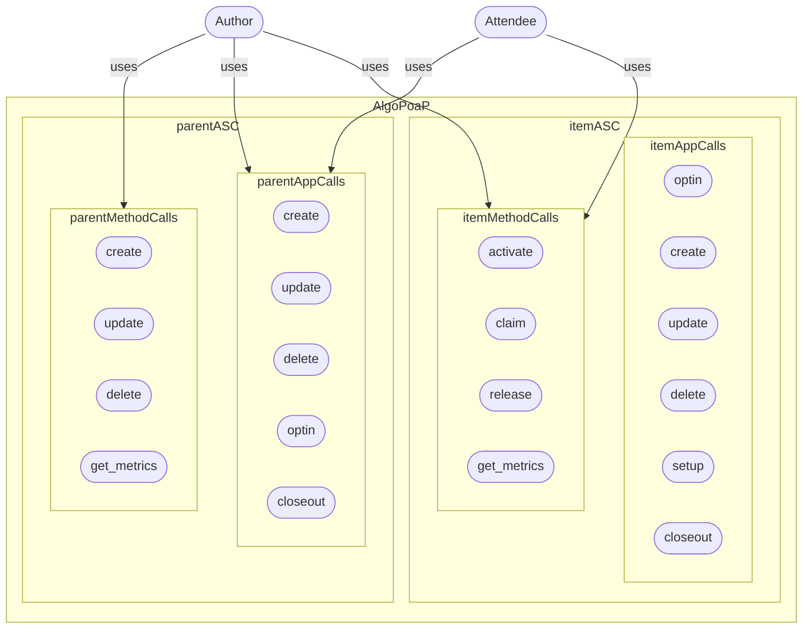

# AlgoPoaP

### **AlgoPoaP** is the Proof of Attendance Protocol built on Algorand (AVM V1.1) which aims to be elevated into a Proof Of Anything Protocol in future (with use of coming state proofs feature on Algorand).

The original idea of PoaP on blockchain is developed for Ethereum ecosystem and is Token based and lacks many features. **AlgoPoaP** elevates, extends and expands that original idea and implements it on Algorand. 

**AlgoPoaP** dApp is consisted of a frontend calling an Algorand ASC system in which ASCs use each other via C2C calls introduced in Algorand AVM V1.1

----

----

## AlgoPoaP's frontend application and landing page, SPA-PWA:

- [AlgoPoaP's Smart Contracts Repository](https://github.com/AlgoPoaP/algopoap-smartcontracts)

- [AlgoPoaP's Frontend Repository](https://github.com/AlgoPoaP/algopoap)

** Both will be public soon, WIP! **

**AlgoPoaP** features that are not available on ETH PoaP (it actually only supports time currently!):

- Geo constraint option (location + buffer area radius)
- Authorization Signature constraint option (Author must sign the release before PoaP issuance for claimed Attendees)
- QRCode constraint option (Attendee must scan and then call the AlgoPoaP Item ASC with it in order to claim).
- NFT based or NFT-less (Using transaction note only)

Note: AlgoPoaP does not use a single token for issuing PoaPs , instead it uses a per AlgoPoaP item NFT generation (if selected by Author) approach. 

**AlgoPoaP** is consisted of a frontend and smart contracts on Algorand chain:
- Frontend
- Smart Contracts

**AlgoPoaP** frontend has 3 major functions (all in a single view for simplicity):
- Wallet Session
- Author UI
- Attend UI

Note: Frontend will be available through both cloudflare (heavily distributed on edge) and IPFS to ensure decentralization (with transparent routing for best UX).

----

### Author's Journey:

1- Author easily gets onboard by opting into AlgoPoaP's parent ASC.

2- Then can create a new PoaP venue.

3- Then activate the venue to let claims begin (This differs than start time option of PoaP).

Note : If SIG is not enabled for PoaP Venue, Claim approval will send PoaP NFT or TXN to Attendee's wallet but if SIG is enabled then after signing of Author, PoaP NFT or TXN will be sent automatically to attendee's wallet, after author signs and sends a release method call transaction to release all successfully claimed AlgoPoaP attendees. 

Options available for PoaP creation:

- Time (default enabled): Start time check (compared to LatestTimestamp)
- Geo: Location point check to be inside a geofence with desired radius (in meters with min of 5m and max of 1000m).
- Signature: Author's signature is needed to make PoaP claimable for every attendee, individually. Each and every attendee can receive their single claimed PoaP (in NFT or TXN depending on PoaP config) only after Author's authorization via a successful method call (which obviously should happen after both venue activation and venue start time). 
- QRCode: Upon activation a secret key will be generated and included in a transaction as a method input parameter and this TXN is then communicated by a QRCode in venue location and Attendee scans this QRCode during physical presence and claims (other arguments will be added to this raw transaction object after scan and when claiming).

Note: QRCode feature is still under heavy re-ideation, re-design and re-everything! So please, kindly consider it WIP and FUTURE release functionality!

----
### Attendee's Journey:

1- Attendee simply gets onboard by opting into parent ASC.

2- Then get a searchable list of PoaP venues and applys to one by opting into it.

3- Then after general venue activation (by author) and by satisfying what PoaP venue options require, claim the PoaP and get PoaP NFT if approved.

Note : If SIG is not enabled for PoaP Venue, Claim approval will send PoaP NFT to Attendee's wallet but if SIG is enabled then after signing of Author, it'l be sent automatically to attendee's wallet.

----
## AlgoPoaP Smart Contracts 

AlgoPoaP ASC System is designed on basis of newest TEAL features came with TEAL v 6.0 on AVM V1.1. AlgoPoaP Parent contract is created and thereafter every AlgoPoaP item is created by this parent contract based on configurations needed.

----
### Entities Relations:

----

### Lifecycle:

----

### UseCase:

----

### AlgoPoaP ASC TEAL Graph:

----

### AlgoPoaP ASC ABI :

Note 1: Data fields are global states of AlgoPoaP parent smart contract.

Note 2: Fee collection is not included anywhere at this phase of AlgoPoaP MVP development but certainly is a priority prior to public TESTNET deployment. It happens on parent smart contract.

Note 1: Author has all metrics in localState of AlgoPoaP Item smart contract and all Authored AlgoPoaPs (upt to 16 item) in localState of AlgoPoaP smart contract (parent) 

----

### AlgoPoaP Item ASC TEAL Graph:

----
### AlgoPoaP ASC ITEM ABI :

Note: Data fields are global states of AlgoPoaP item smart contract.

----

Since AlgoPoaP is totally decentralized, trustless and permission-less: Every AlgoPoaP item author has full authority of the created PoaPs (AlgoPoaP-DAO is coming with dao, voting and governance features in near future, after startup formation. Preferably I will use integration to an already working service with ABI)!

The algopoap_contract.json contains the ABI Schema for parent AlgoPoaP contract and algopoap_item_contract.json is the full ABI Schema of AlgoPoaP item contract which will be created by an C2C call via an inner transaction.

