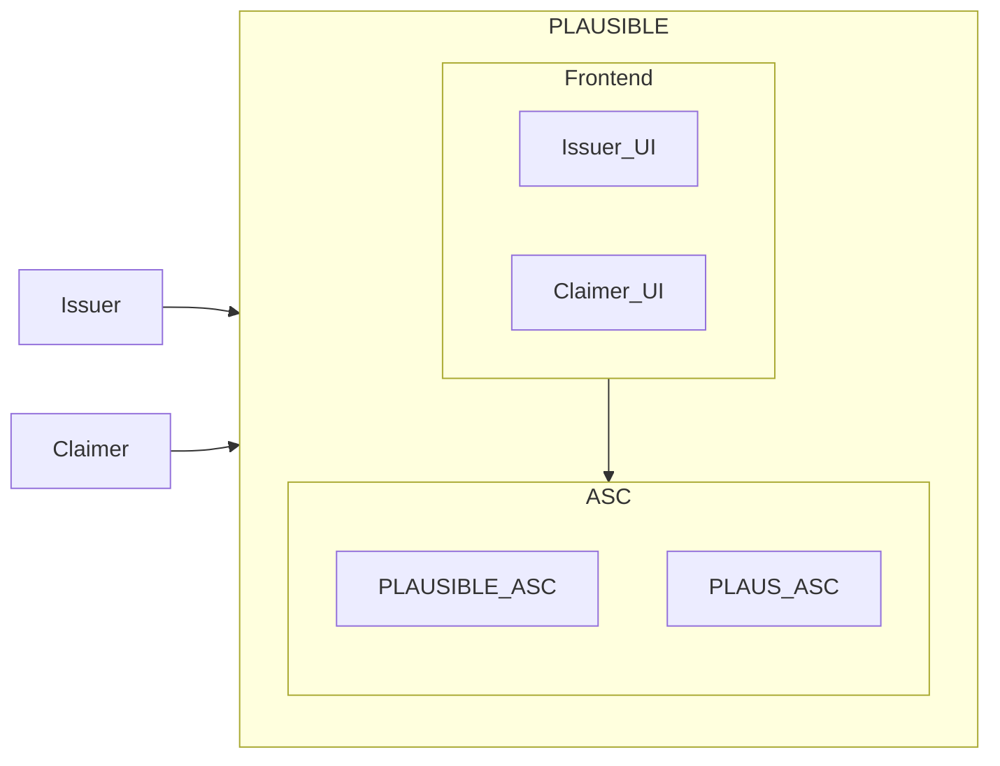
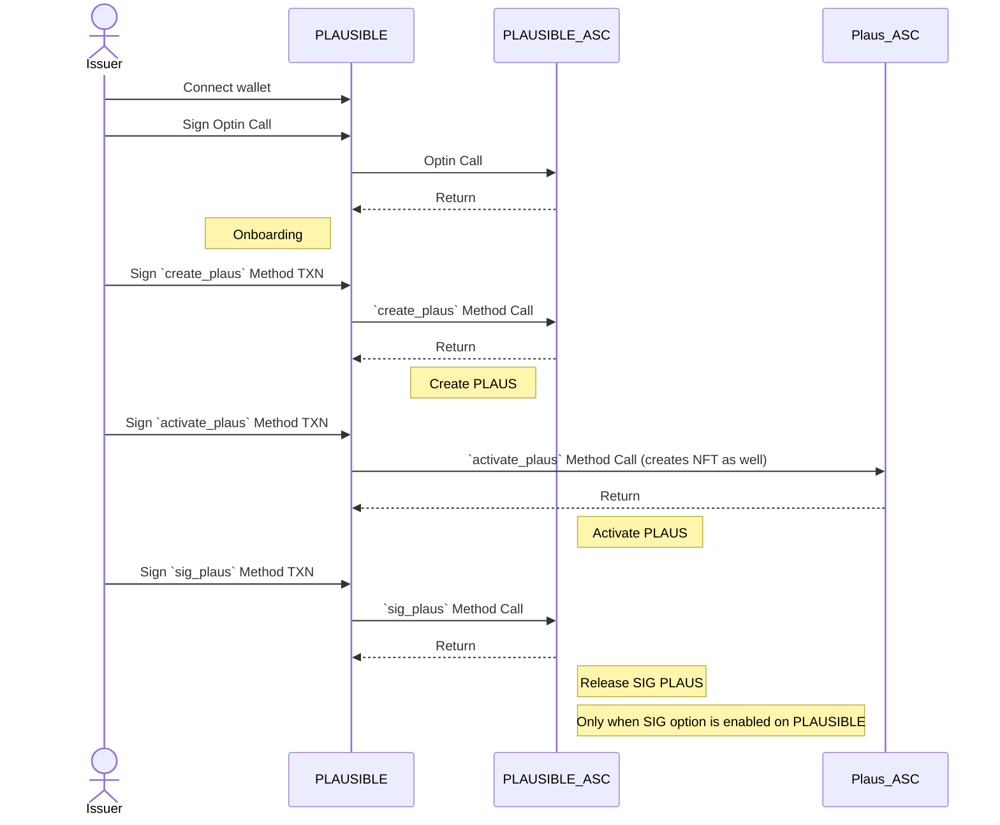
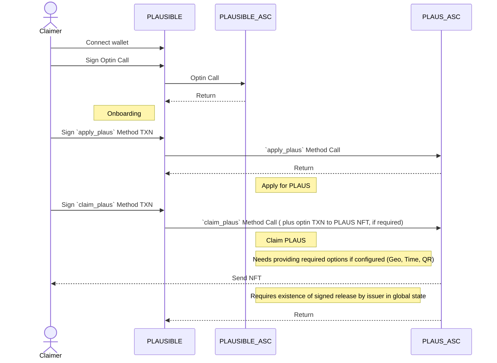
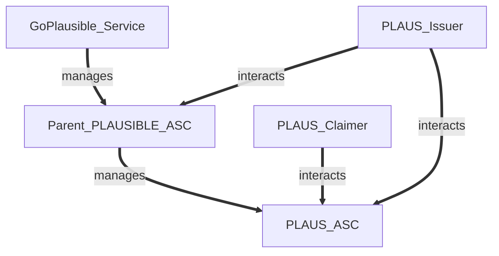
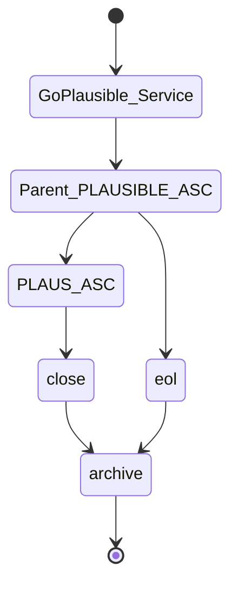
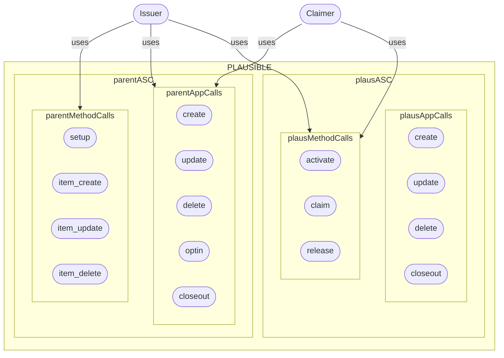
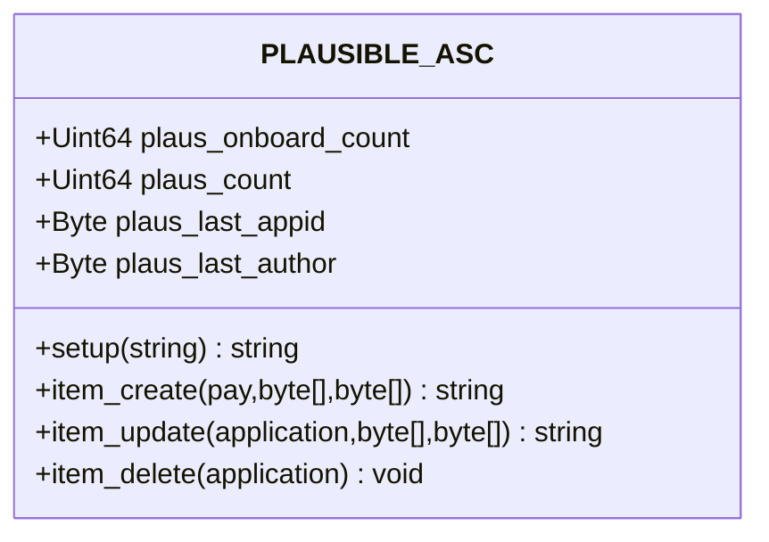
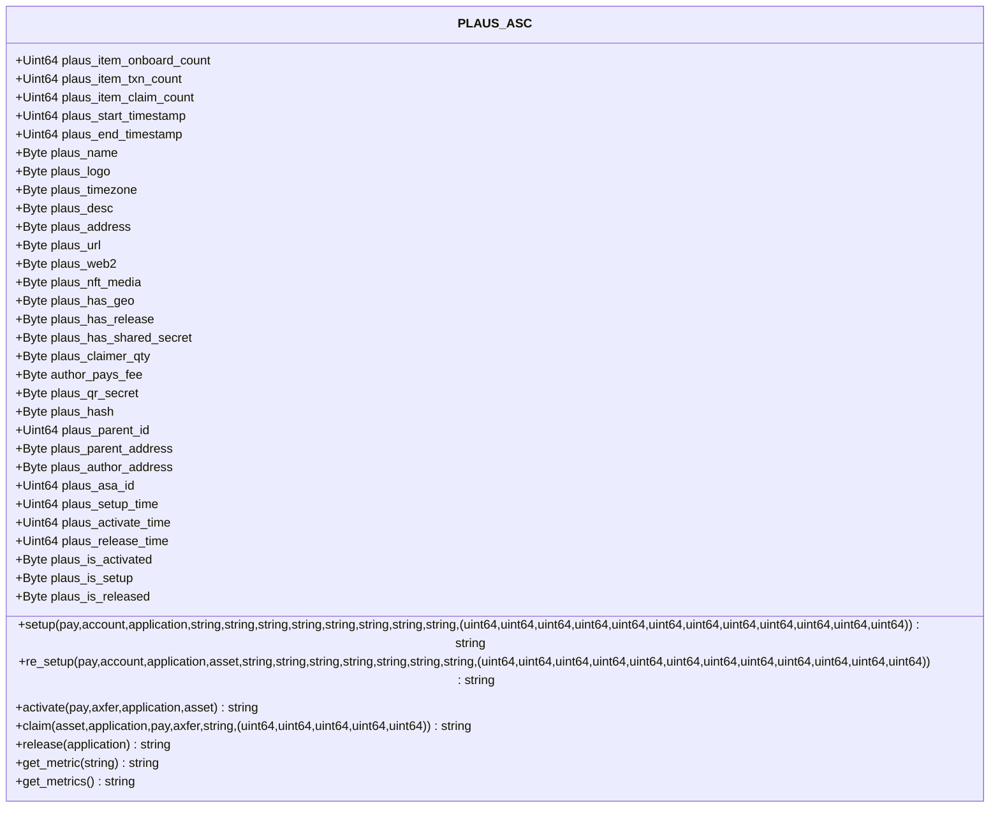

# PLAUSIBLE protocol:

This document provides a technical overview and reference guide for the PLAUSIBLE protocol architecture, smart contracts, and design principles.

- [Back to GoPlausible](./README.md)
- [PLAUSIBLE Protocol API Docs guide](./README_API.md)

---


[top↑](#plausible-protocol)

### PLAUSIBLE Protocol Table of Contents:

  - [Protocl features](#plausible-protocol-features)
  - [Issuer's Journey](#issuers-journey)
  - [Claimer's Journey](#claimers-journey)
  - [Smart Contracts](#plausible-protocol-smart-contracts)

### PLAUSIBLE protocol features :
[top↑](#plausible-protocol)

- All operations are in full compliance and conformance to W3C DID, VC, VP , DRL and other standards.

- Geo (allow and ban lists), Time, List, Token, Github, SSI and email constraint features.
  
- WebAuthn, Oauth 2.2, OIDC, OIDC-VC integration.
  
- Double pinning of all IPFS content (media and metadata) into Pinata and CrustNetwork (the best centralized and the best-decentralized networks for IPFS pinning).
  
- Dynamic NFTs per PLAUS (PLAUSIBLE protocol is 100% token-less and NFTs are generated and owned by PLAUS contract which belongs to PLAUS issuer).
  


PLAUSIBLE protocol consists of a frontend and smart contracts on the Algorand chain:
- Frontend (Cloudflare Pages React SPA/PWA )
- Edge workers (Cloudflare Workers for GoPlausible public and private APIs)
- Smart Contracts (Algorand smart contracts and GoPlausible ABIs)


PLAUSIBLE protocol's frontend has 3 major functions (all in a single view for simplicity):
- Wallet Session
- Issuer UI
- Claimer UI

Note: Frontend is accessible through cloudflare pages and page workers (heavily distributed globally on edge).




----

### Issuers Journey:
[top↑](#plausible-protocol)

1- Issuer easily gets onboard to GoPlausible by opting into PLAUSIBLE protocol's parent Algorand smart contract. This issues a DID and a Verifiable Credential by PLAUSIBLE protocol for the issuer and combined with account's NFD , creates a profile.

2- Then can Issue new PLAUS (W3C DID based verifiable credentials with NFTs in background).

3- Then activate the PLAUS to let claims begin (This differs than start time option).


Options available for PLAUS creation:

- Time (default enabled): Start time check (compared to LatestTimestamp)
- Geo: Country allow and ban lists.
- Signature: Issuer's signature is needed to make PLAUS claimable for every Claimer, individually. Each and every Claimer can receive their single claimed PLAUS (in NFT or TXN depending on PLAUS configuration) only after Issuer's authorization via a successful method call (which obviously should happen after both venue activation and venue start time). 
- QRCode: Upon activation a secret key will be generated and included in a transaction as a method input parameter and this TXN is then communicated by a QRCode in venue location and Claimer scans this QRCode during physical presence and claims (other arguments will be added to this raw transaction object after scan and when claiming).

Note: QRCode feature is still under heavy re-ideation, re-design and re-everything! So please, kindly consider it WIP and FUTURE release functionality!



----
### Claimers Journey:
[top↑](#plausible-protocol)

1- After PLAUS activation (by Issuer) and by satisfying what PLAUS configuration mandates from claimers, eligible users can claim the PLAUS and get NFT and attached Verifiable Credential if approved by PLAUS smart contract.

2- Claimer simply gets onboard by opting into parent ASC from UI (one button click).

3-  Then get a searchable list of claimed PLAUS so far and can activate the creator mode to Issue new PLAUS at any time given there is enough balance in the account.




----

## PLAUSIBLE protocol Smart Contracts 
[top↑](#plausible-protocol)

PLAUSIBLE protocol smart contract system is designed on basis of features & opcodes in TEAL v 8.0 on AVM8. PLAUSIBLE Parent contract generates and configures and controls only the lifecycles step of each PLAUS. The PLAUS internals and operations are solely controlled by PLAUS issuer.


### Entities Relations:



----

### Lifecycle:


----


### UseCase:

**Note: The NoOp calls without args will be rejected with error. This is being examined as a security practice**


----

### PLAUSIBLE prtocol contract TEAL Graph:
[top↑](#plausible-protocol)


----

### PLAUSIBLE protocol ASC ABI :
[top↑](#plausible-protocol)

Note 1: Data fields are global states and boxes of PLAUSIBLE parent smart contract.




----

### PLAUSIBLE ASC ABI Schema :
[top↑](#plausible-protocol)

```javascript
{
  "name":"plausible-contract",
  "desc": "PLAUSIBLE Parent smart contract",
  "networks":{
      "MainNet":{
          "appID": 0
      },
      "TestNet":{
          "appID": 0
      }
  },
  "methods":[
    {
          "name": "setup",
          "args": [
            {
              "type": "string",
              "name": "version"
            }
          ],
          "returns": {
            "type": "string"
          },
          "desc": "Sets up the PLAUSIBLE main contract, sets and logs the version and returns"
        },
      {
          "name": "item_create",
          "args": [
            {
              "type": "pay",
              "name": "pay"
            },
            {
              "type": "byte[]",
              "name": "asc_approval_bytes"
            },
            {
              "type": "byte[]",
              "name": "asc_clear_bytes"
            }
          ],
          "returns": {
            "type": "string"
          },
          "desc": "Creates a new PLAUS smart contract and returns the app id"
        },
        {
          "name": "item_update",
          "args": [
            {
              "type": "application",
              "name": "application"
            },
            {
              "type": "byte[]",
              "name": "asc_approval_bytes"
            },
            {
              "type": "byte[]",
              "name": "asc_clear_bytes"
            }
          ],
          "returns": {
            "type": "string"
          },
          "desc": "Updates an PLAUS smart contract and returns item application ID"
        },
        {
          "name": "item_delete",
          "args": [
            {
              "type": "application",
              "name": "application"
            }
          ],
          "returns": {
            "type": "void"
          },
          "desc": "Deletes an PLAUS smart contract and returns void (approve only)"
        }
  ]
}

```
----

### PLAUS ASC TEAL Graph:
[top↑](#plausible-protocol)


----

### PLAUS ASC ABI :
[top↑](#plausible-protocol)

Note 1: Data fields are global states and boxes of PLAUS smart contract.



----

### PLAUS ASC ABI Schema :
[top↑](#plausible-protocol)

```javascript
{
    "name": "plaus-contract",
    "desc": "PLAUS smart contract",
    "networks": {
        "MainNet": {
            "appID": 0
        },
        "TestNet": {
            "appID": 109691598
        }
    },
    "methods": [
        {
            "name": "setup",
            "args": [
                {
                    "type": "pay",
                    "name": "pay_min_fee"
                },
                {
                    "type": "account",
                    "name": "author_account"
                },
                {
                    "type": "application",
                    "name": "parent_application"
                },
                {
                    "type": "string",
                    "name": "reserved"
                },
                {
                    "type": "string",
                    "name": "plaus_name"
                },
                {
                    "type": "string",
                    "name": "plaus_logo"
                },
                {
                    "type": "string",
                    "name": "plaus_desc"
                },
                {
                    "type": "string",
                    "name": "plaus_timezone"
                },
                {
                    "type": "string",
                    "name": "plaus_address"
                },
                {
                    "type": "string",
                    "name": "plaus_url"
                },
                {
                    "type": "string",
                    "name": "plaus_web2"
                },
                {
                    "type": "(uint64,uint64,uint64,uint64,uint64,uint64,uint64,uint64,uint64,uint64,uint64,uint64)",
                    "name": "plaus_uint64_tuple"
                }
            ],
            "returns": {
                "type": "string"
            },
            "desc": "Sets up an PLAUS contract"
        },
        {
            "name": "activate",
            "args": [
                {
                    "type": "pay",
                    "name": "pay_min_fees"
                },
                {
                    "type": "axfer",
                    "name": "optin_plaus_nft"
                },
                {
                    "type": "application",
                    "name": "parent_application"
                },
                {
                    "type": "asset",
                    "name": "nft_asa"
                }
            ],
            "returns": {
                "type": "string"
            },
            "desc": "Activates an PLAUS smart contract and returns string"
        },
        {
            "name": "claim",
            "args": [
                {
                    "type": "pay",
                    "name": "pay_min_fee"
                },
                {
                    "type": "asset",
                    "name": "nft_asset"
                },
                {
                    "type": "application",
                    "name": "parent_application"
                },
                {
                    "type": "account",
                    "name": "claimer_account"
                },
                {
                    "type": "string",
                    "name": "qr_secret"
                },
                {
                    "type": "(uint64,uint64,uint64,uint64,uint64)",
                    "name": "claim_uint64_tuple"
                }
            ],
            "returns": {
                "type": "string"
            },
            "desc": "Claims a PLAUS for a claimer and returns NFT sending inner-transaction hash"
        },
        {
            "name": "release",
            "args": [
                {
                    "type": "application",
                    "name": "parent_contract"
                }
            ],
            "returns": {
                "type": "string"
            },
            "desc": "Releases PLAUS and allows all PLAUS claimer's to start claiming"
        }
    ]
}

```
----
## Contributing

We welcome contributions and suggestions. Please open a pull request or an issue on our GitHub repository if you have any questions or ideas.

## License

This API and its documentation are provided for informational and integration purposes. For licensing information, consult the official GoPlausible or contact the team members on socials.

