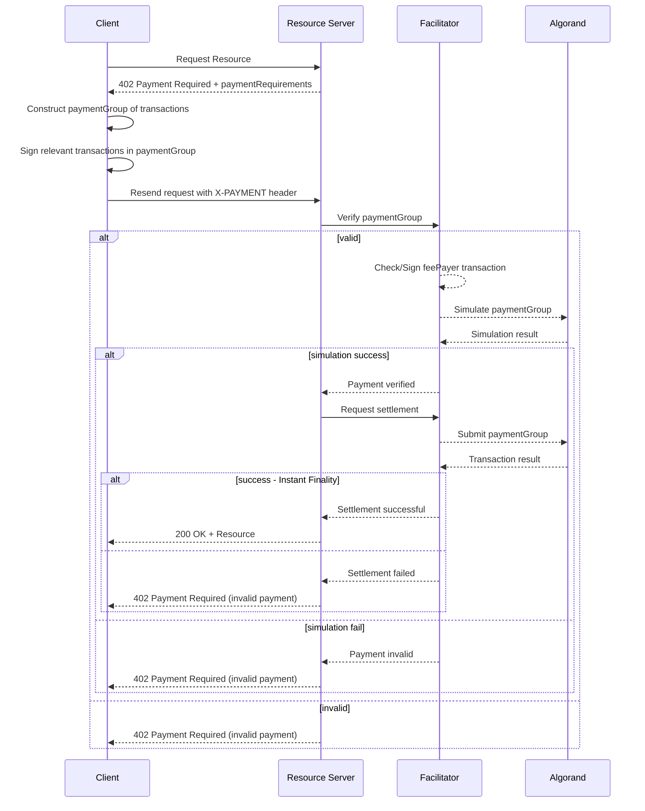

# Scheme: `exact` on `Algorand`

## Summary

The `exact` scheme on Algorand uses the Algorand Standard Asset (ASA), native assets (no contract required) of the Algorand protocol, to authorize a transfer of a specific amount from the payor to the resource server. The approach results in the facilitator having no ability to direct funds anywhere but the address specified by the resource server in `paymentRequirements`.

## Sequence of operations



## `paymentRequirements` for Payment Required Response

In the `exact` scheme on Algorand, the `paymentRequirements` record **MAY** include a `feePayer` field inside the `extra` element. This informs the client they **MAY** construct a transaction that includes a 0 Algo payment transaction, from the `feePayer`, with a `fee` value that's enough to cover the cost of their transaction(s). This transaction would be included in the same atomic group as the expected asset transfer transaction, and will be signed by the `Facilitator` after verifying the transaction group and before settling to the network.

Additionally the `paymentRequirements.asset` field **MUST** be a string representing an ASA ID (64-bit unsigned integer) instead of an `ERC20` contract address. This **MUST** be validated by the resource server to ensure the `asset` field is valid when using the Algorand scheme.

### `paymentRequirements.extra` specification:

```json5
  {
    // Optional Algorand address that will pay the transaction fees.
    feePayer?: string;
  }
```

Full `paymentRequirements` Example:

```json
{
  "scheme": "exact",
  "network": "algorand-mainnet",
  "maxAmountRequired": "5000000",
  "resource": "https://example.net/signup",
  "description": "$5 registration payment",
  "mimeType": "text/html",
  "outputSchema": null,
  "payTo": "RESOURCESERVERADDRESSAAAAAAAAAAAAAAAAAAAAAAAAAAAAAALTSRPAE",
  "maxTimeoutSeconds": 60,
  "asset": "31566704",
  "extra": {
    "feePayer": "FACILITATORADDRESSAAAAAAAAAAAAAAAAAAAAAAAAAAAAAAAAALQCXBZE",
  }
}
```

## `X-Payment` Header Payload

The `payload` field of the `X-PAYMENT` header **MUST** contain `paymentGroup` as a field. It represents an atomic group of transactions as an array. Transaction groups are natively supported by the Algorand protocol (no contract required), enabling the execution of several transactions (even with different authorizers) processed atomically (no partial execution is allowed, either all the transactions in the group succeed or the entire group is rejected).

A group can contain several different types of transactions, such as `pay` (transfer of ALGO native protocol asset) and `axfer` (transfer of generic ASA), and others (for further details on supported transaction types, refer to the [Algorand transactions documentation](https://dev.algorand.co/concepts/transactions/reference/).

As part of the payload there **MUST** also be a `paymentIndex` field which identifies the transaction in the group that will pay the resource server. The group may perform several operations to facilitate the payment, such as swaps or asset transfers, but only one transaction in the group will actually transfer the funds to the resource server.

> In a single standalone transaction, the `paymentIndex` **MUST** be set to 0.

Multiple signers can be in the group, and fees can be pooled together or assigned to a specific signer, meaning they can be delegated to a specific account to pay the fees for the group. A group can include a maximum of:

- 16 _top-level transactions_, authorized either with a single signature (`Ed25519`), a `k-of-n` threshold multi-signature, or a logic signature;
- 256 _inner transactions_, authorized by an application (smart contract).

Example of a USDC asset transfer with an abstracted fee (i.e paid by the facilitator):

```json
{
  "paymentIndex": 1, // 0th index of the transaction in the group that will pay the resource server
  "paymentGroup": [
    "gaN0eG6Jo2ZlZc0H0KJmds4DLgNro2dlbqxtYWlubmV0LXYxLjCiZ2jEIMBhxNj8Hb3e0tdgS+RWjj9tBBmHrDe95LYgtas5JIrfo2dycMQgfy1Szr+lgvgTJsviMY2KnHSsXqyfCJ1UOCE+2Tf3vS+ibHbOAy4HU6NyY3bEICgEhaJgm6IBjiSUgAAAAAAAAAAAAAAAAAAAAAAAAAAAo3NuZMQgKASFomCbogGOJJSAAAAAAAAAAAAAAAAAAAAAAAAAAACkdHlwZaNwYXk=",
    "gqNzaWfEQP3J1DI6GLSfK0nLZftvSyVMJuFOE48xPlnZpNdEJWbGbcxsD5aASwza4TjbwhgEF0dXOv8E3W/f22vkEzfFywWjdHhuiaRhYW10zgBMS0CkYXJjdsQgiSTqRESRI1JEAxxJKQAAAAAAAAAAAAAAAAAAAAAAAACiZnbOAy4Da6JnaMQgwGHE2Pwdvd7S12BL5FaOP20EGYesN73ktiC1qzkkit+jZ3JwxCB/LVLOv6WC+BMmy+IxjYqcdKxerJ8InVQ4IT7ZN/e9L6Jsds4DLgdTo3NuZMQgEtBGzAAAAAAAAAAAAAAAAAAAAAAAAAAAAAAAAAAAAACkdHlwZaVheGZlcqR4YWlkzgHhq3A="
  ]
}
```

### Full `X-PAYMENT` header example:

```json
{
  "x402Version": 1,
  "scheme": "exact",
  "network": "algorand-mainnet",
  "payload": {
    "paymentIndex": 1,
    "paymentGroup": [
      "gaN0eG6Jo2ZlZc0H0KJmds4DLgNro2dlbqxtYWlubmV0LXYxLjCiZ2jEIMBhxNj8Hb3e0tdgS+RWjj9tBBmHrDe95LYgtas5JIrfo2dycMQgfy1Szr+lgvgTJsviMY2KnHSsXqyfCJ1UOCE+2Tf3vS+ibHbOAy4HU6NyY3bEICgEhaJgm6IBjiSUgAAAAAAAAAAAAAAAAAAAAAAAAAAAo3NuZMQgKASFomCbogGOJJSAAAAAAAAAAAAAAAAAAAAAAAAAAACkdHlwZaNwYXk=",
      "gqNzaWfEQP3J1DI6GLSfK0nLZftvSyVMJuFOE48xPlnZpNdEJWbGbcxsD5aASwza4TjbwhgEF0dXOv8E3W/f22vkEzfFywWjdHhuiaRhYW10zgBMS0CkYXJjdsQgiSTqRESRI1JEAxxJKQAAAAAAAAAAAAAAAAAAAAAAAACiZnbOAy4Da6JnaMQgwGHE2Pwdvd7S12BL5FaOP20EGYesN73ktiC1qzkkit+jZ3JwxCB/LVLOv6WC+BMmy+IxjYqcdKxerJ8InVQ4IT7ZN/e9L6Jsds4DLgdTo3NuZMQgEtBGzAAAAAAAAAAAAAAAAAAAAAAAAAAAAAAAAAAAAACkdHlwZaVheGZlcqR4YWlkzgHhq3A="
    ]
  }
}
```

## `X-Payment-Response` Header

Upon a successful settlement, the `X-PAYMENT-RESPONSE` **MUST** return the transaction ID of the `paymentGroup[paymentIndex]` transaction. This identifies the specific asset transfer transaction to the `payTo` address for the `maxAmountRequired`, and can be used to identify the transaction on the network.

Should the settlement fail, the transaction ID **SHOULD** be returned, but since failed transactions are not committed to the network, it might not be visible on the chain.

### Full `X-PAYMENT-RESPONSE` header example:

```json
{
  "success": true,
  "error": null,
  "txHash": "NTRZR6HGMMZGYMJKUNVNLKLA427ACAVIPFNC6JHA5XNBQQHW7MWA",
  "networkId": "algorand-mainnet"
}
```

## Verification

Steps to verify a payment for the `exact` scheme on Algorand:

1. Check the `paymentGroup` contains 16 or fewer elements.
1. Decode all transactions from the `paymentGrouop`.
1. Locate the `paymentGroup[paymentIndex]` transaction from the `Payment Payload`.
    1. Check the `aamt` (asset amount) matches `maxAmountRequired` from the `Payment Requirements`.
    1. Check the `arcv` (asset receiver) matches `payTo` from the `Payment Requirements`.
1. Locate all transactions where for `snd` (sender) is the `Facilitator`s Algorand address.
    1. Check the `type` (transaction type) is `pay`.
    1. Check the following fields are omitted: `close`, `rekey`, `amt`.
    1. Check the `fee` (Fee) is a reasonable amount.
    1. Sign the transaction.
1. Evaluate the payment group against an Algorand node's `simulate` endpoint to ensure the transactions would succeed.

## Settlement

Once the group is validated by the resource server, settlement can occur by the facilitator submitting the verified transaction group to the Algorand network through the `v2/transactions` endpoint against any valid Algorand node.

In Algorand there are no consensus forks and so it achieves instant finality the moment a transaction is included in a block. So as soon as the transaction is included in a block, the payment is considered settled and the facilitator can inform the resource server of the successful payment and proceed with the resource delivery.

## Additional Considerations

### Assets

In order for the resource server to receive payment on a particular Asset, it **MUST** be opted-in to that asset. In Algorand, accounts explicitly enable receiving a particular asset, otherwise an asset transfer to that account will be rejected. So as part of the resource server's setup, it **SHOULD** ensure it has opted-in to the asset ID specified in the `paymentRequirements.asset`.

### Multiple Payments

The facilitator may want to account for multiple payments and `feePayer` transactions in a single group. If the client knows what they're paying for and constructs multiple payments in one group, there could be up to 16 payments to the resource server, or 8 gasless payments.

### Signature Scheme

Each _top-level transaction_ in the `paymentGroup` **MUST** be signed individually by each of the owners of the sender addresses in the group.

In Algorand, signatures of _top-level transactions_ are based either on:

- A `Ed25519` single signature scheme (`sig`);
- A `k-of-n` threshold [multi-signature](https://dev.algorand.co/concepts/transactions/signing/#multisignatures) (`msig`);
- A [Logic Signature](https://dev.algorand.co/concepts/smart-contracts/logic-sigs/), verified by the Algorand Virtual Machine (`lsig`);

### Algorand Addresses and Public Key relationship

In Algorand, addresses are 58-character base32-encoded representations of either:

- SHA512_256 of the Logic Signatures program bytecode + `Program` as a prefix.
- Public keys, with a sha512_256 checksum (last 4 bytes) appended as a suffix. This encoding ensures that addresses can be derived directly from public keys without requiring a pre-existing signature for operations like `ecRecover` to verify signatures.

Example of encoding Algorand addresses:

```ts
	encodeAddress(publicKey: Buffer): string {
		const keyHash: string = sha512_256.create().update(publicKey).hex()

		// last 4 bytes of the hash
		const checksum: string = keyHash.slice(-8)

		return base32.encode(Encoder.ConcatArrays(publicKey, Buffer.from(checksum, "hex"))).slice(0, 58)
	}
```

### Encoding

Algorand uses [**msgpack**](https://www.npmjs.com/package/algorand-msgpack) to encode the transactions. Each element in the `paymentGroup` array can be base64-decoded, then msgpack-decoded, to reveal the transaction contents. Or using `goal` you can do the following:

```json
% cat payload.json | jq -r '.paymentGroup[]' | base64 -d | goal clerk inspect -
-[0]
{
  "txn": {
    "fee": 2000,
    "fv": 53347179,
    "gen": "mainnet-v1.0",
    "gh": "wGHE2Pwdvd7S12BL5FaOP20EGYesN73ktiC1qzkkit8=",
    "grp": "fy1Szr+lgvgTJsviMY2KnHSsXqyfCJ1UOCE+2Tf3vS8=",
    "lv": 53348179,
    "rcv": "FACILITATORADDRESSAAAAAAAAAAAAAAAAAAAAAAAAAAAAAAAAALQCXBZE",
    "snd": "FACILITATORADDRESSAAAAAAAAAAAAAAAAAAAAAAAAAAAAAAAAALQCXBZE",
    "type": "pay"
  }
}

-[1]
{
  "sig": "/cnUMjoYtJ8rSctl+29LJUwm4U4TjzE+Wdmk10QlZsZtzGwPloBLDNrhONvCGAQXR1c6/wTdb9/ba+QTN8XLBQ==",
  "txn": {
    "aamt": 5000000,
    "arcv": "RESOURCESERVERADDRESSAAAAAAAAAAAAAAAAAAAAAAAAAAAAAALTSRPAE",
    "fv": 53347179,
    "gh": "wGHE2Pwdvd7S12BL5FaOP20EGYesN73ktiC1qzkkit8=",
    "grp": "fy1Szr+lgvgTJsviMY2KnHSsXqyfCJ1UOCE+2Tf3vS8=",
    "lv": 53348179,
    "snd": "CLIENTAAAAAAAAAAAAAAAAAAAAAAAAAAAAAAAAAAAAAAAAAAAAAHFUPIRI",
    "type": "axfer",
    "xaid": 31566704
  }
}
```

## Appendix

### Gasless Transactions/Sponsored Fees

`Facilitator`s who offer "gasless" transactions, may refuse to sign their `feePayer` transaction, if they consider it's been constructed maliciously. These malicious checks may be off-loaded to a logic signature, where the `facilitator` instead provides their signature of the TxID as an argument.
